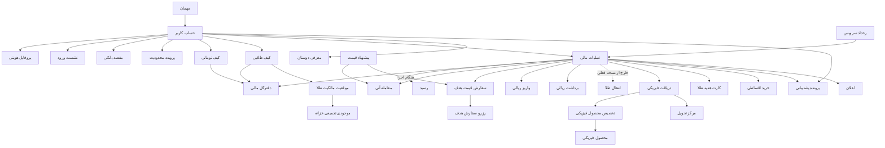
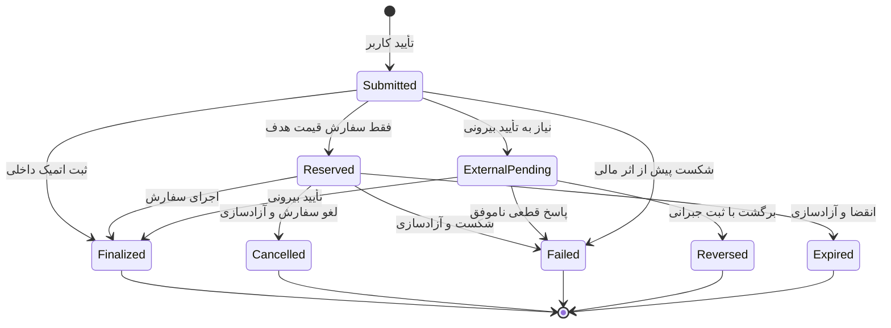

# مدل دامنه و موجودیت‌ها

نسخه: ۰.۲ — ۲۹ تیر ۱۴۰۵ / 20 Jul 2026  
وضعیت: `Sufficient to proceed` — بازبینی مالک محصول انجام شده؛ وابستگی‌های تخصصی برای فلو و Release باز مانده‌اند  
زیرمرحله: ۳.۴ مدل محصول، بسته‌شده با D-081

منابع اصلی: `capability-map.md`، `roles-and-permissions.md`، `business-rules-source-of-truth.md`، `open-questions.md` و تصمیم‌های D-051 تا D-077.

## ۱. هدف و مرز سند

این سند زبان مشترک محصول، طراحی و فنی درباره چیزهایی است که در شمش وجود دارند، رابطه آن‌ها با هم، وضعیت‌هایشان و منبع حقیقت داده هرکدام. این سند **مدل مفهومی محصول** است، نه طراحی دیتابیس، قرارداد API یا تعهد انتشار همه قابلیت‌ها.

- `Business decision`: دامنه فعلی فقط تجربه کاربر نهایی PWA و Android WebView است؛ ابزارهای ادمین، عملیات و پشتیبانی خارج از Scope تجربه‌اند.
- `Business decision`: واحد پول محصول تومان و دارایی فعلی طلای ۱۸ عیار است؛ چندفلزی یک جهت آینده است، نه بخشی از مدل اجرایی فعلی.
- `Business decision`: کارت هدیه طلا، خرید اقساطی طلای دیجیتال و معرفی دوستان جزو Release اول هستند؛ موجودیت‌های سایر قابلیت‌های آینده فقط برای جلوگیری از بن‌بست معماری ثبت می‌شوند.
- `Business decision`: انتقال کاربر‌به‌کاربر با D-087 از نسخه فعلی حذف شده و فقط برای بررسی آینده در مدل مفهومی نگهداری می‌شود.
- `Risk`: قواعد تازه حقوقی و خزانه‌داری ممکن است بر کیف، روش‌های بانکی و تحویل فیزیکی اثر بگذارد؛ OQ-045 باید پیش از نهایی‌شدن مدل بررسی شود.

## ۲. اصول مدل‌سازی

1. **وضعیت کاربر یک فیلد واحد نیست.** دسترسی کاربر از ترکیب ورود، احراز هویت، اعتبار نشست و محدودیت حساب به‌دست می‌آید.
2. **دفترکل منبع حقیقت مالی است.** کیف تومانی و طلایی نمایی قابل‌فهم از حساب‌های دفترکل‌اند، نه منبع مستقل موجودی.
3. **رزرو فقط برای سفارش قیمت هدف است.** پس از تأیید سفارش خرید، تومان و پس از تأیید سفارش فروش، طلا رزرو می‌شود؛ سایر عملیات رزرو ندارند و اثر مالی‌شان در نقطه قطعی همان subtype ثبت می‌شود.
4. **اصلاح با رکورد جدید انجام می‌شود.** تراکنش و سند مالی نهایی حذف یا بازنویسی نمی‌شود؛ اصلاح باید با ثبت جبرانی قابل‌ردیابی باشد.
5. **وضعیت‌های نمایشی نوع‌محورند.** وضعیت یک برداشت با وضعیت تحویل فیزیکی یکی نیست؛ چرخه عمومی فقط برای هماهنگی داخلی استفاده می‌شود.
6. **موارد باز، واقعیت محصول نیستند.** هرجا قانون قطعی نداریم، موجودیت یا رابطه با `Open question` یا `Design assumption` مشخص شده است.

## ۳. نمای مفهومی

این نمودار وابستگی مفهومی را نشان می‌دهد، نه کاردینالیتی دیتابیس.

## ۴. مدل هویت و دسترسی

وضعیت بازبینی: تأییدشده توسط مالک محصول — D-078

### ۴.۱ ابعاد مستقل دسترسی

| بُعد | مقادیر | اثر اصلی |
|---|---|---|
| حضور حساب | مهمان / کاربر واردشده | مهمان حساب مالی و کیف ندارد. |
| احراز هویت | احرازنشده / تأییدشده | عملیات مالی فعال فقط برای کاربر تأییدشده مجاز است؛ انتقال طلا در نسخه فعلی فعال نیست. |
| نشست | معتبر / منقضی | نشست پس از ۲۴ ساعت از آخرین OTP موفق منقضی و ورود دوباره لازم می‌شود. |
| محدودیت | بدون محدودیت / محدودیت یک عملیات / محدودیت همه عملیات مالی / قفل ورود | دسترسی مؤثر مطابق کمترین سطح دسترسی مجاز محاسبه می‌شود. |

`Business decision`: «کاربر احرازنشده» وضعیت حساب است، اما Guest موجودیت مستقل پایدار نیست و فقط یک context پیش از ساخت/ورود به حساب است.

### ۴.۲ موجودیت‌های هویت و دسترسی

| موجودیت | تعریف و داده‌های کلیدی | رابطه اصلی | وضعیت / منبع حقیقت |
|---|---|---|---|
| `UserAccount` | شناسه پایدار کاربر، موبایل اصلی، زمان ایجاد | یک پروفایل هویتی، چند نشست، حداکثر پنج مقصد بانکی | `Business decision`؛ سرویس حساب |
| `InternalAccountNumber` | شماره حساب داخلی یکتای کاربر برای شناسایی حساب در اسناد داخلی و قابلیت‌های آینده | دقیقاً متعلق به یک حساب؛ نمایش در رسید انتقال فعلاً موضوعیت ندارد | سرویس حساب |
| `IdentityProfile` | کد ملی، تاریخ تولد و نتیجه تطبیق با شماره موبایل | دقیقاً متعلق به یک حساب | احرازنشده / تأییدشده؛ سرویس احراز |
| `AuthSession` | نشست ورود، دستگاه، زمان OTP موفق و انقضا | چند نشست برای یک حساب | معتبر / منقضی / خاتمه‌یافته؛ سرویس هویت |
| `BankInstrument` | کارت یا شبا ثبت‌شده متعلق به کاربر و داده لازم برای واریز/برداشت | حداکثر مجموعاً پنج کارت و شبا برای هر حساب | فعال / غیرفعال؛ مالکیت باید با کد ملی کنترل شود |
| `RestrictionCase` | علت، سطح، دامنه عملیات، شروع، پایان، مرجع و توضیح قابل‌نمایش | صفر یا چند پرونده برای حساب | فعال / رفع‌شده؛ ریسک، دستور قانونی، سوءاستفاده یا شرایط حقوقی |
| `ConsentRecord` | نسخه شرایط، زمان و کانال پذیرش | متعلق به حساب و نسخه سند | `Open question`: نوع اسناد و الزام پذیرش مجدد هنوز زیر OQ-026 قطعی نیست |

## ۵. هسته مالی و دفترکل

| موجودیت | تعریف و داده‌های کلیدی | قاعده اصلی | منبع حقیقت |
|---|---|---|---|
| `TomanWallet` | نمای تومانی کاربر با «موجودی» و «قابل استفاده» | منفی نمی‌شود؛ رزرو سفارش خرید در محاسبه موجودی قابل استفاده لحاظ می‌شود | دفترکل تومان |
| `GoldWallet` | نمای طلای ۱۸ عیار با «موجودی» و «قابل استفاده» به گرم | دقت داخلی و نمایشی سه رقم اعشار؛ حداقل و گام یک سوت | دفترکل طلا |
| `LedgerAccount` | حساب داخلی برای دارایی قابل استفاده، رزروشده، در راه، مسدود یا اصلاحات | هر حساب یک واحد و مالک مشخص دارد | سامانه دفترکل |
| `LedgerEntry` | ثبت تغییرناپذیر بدهکار/بستانکار با واحد، مقدار، زمان و مرجع عملیات | مجموع ثبت‌ها باید تراز باشد؛ حذف و ویرایش ممنوع | سامانه دفترکل |
| `BalanceReservation` | قفل موقت تومان یا طلا فقط برای سفارش قیمت هدف تأییدشده | با اجرای سفارش مصرف و با شکست، لغو یا انقضا آزاد می‌شود | سامانه دفترکل |
| `LockedGoldPosition` | طلای متعلق به کاربر که به علت قرارداد اقساطی موقتاً قابل معامله، انتقال یا تحویل نیست | رزرو سفارش نیست؛ پس از تسویه کامل قرارداد آزاد می‌شود | دفترکل طلا + قرارداد اقساط |
| `FinancialOperation` | پوسته مشترک داخلی برای هر اقدام مالی با نوع، مبلغ/وزن، کارمزد، مالک، زمان و شناسه همبستگی | چرخه داخلی دارد؛ وضعیت نمایشی از subtype می‌آید | هماهنگ‌کننده تراکنش |
| `Receipt` | سند قابل پیگیری عملیات شامل نوع، مبلغ/وزن، نرخ، کارمزد، زمان و کد پیگیری | رسید نهایی فقط بعد از نهایی‌شدن؛ پیش از آن وضعیت/رسید موقت | سامانه اسناد مالی |
| `FinancialAdjustment` | ادعا، اختلاف یا اصلاح مانده با علت، مرجع، تأییدکننده و ثبت جبرانی | هر اصلاح یک تراکنش جدید است | دفترکل + کنترل مالی |
| `BusinessRuleConfig` | حدود، کارمزدها، دقت، زمان‌ها و قواعد فعال | نسخه جاری از پنل مدیریت؛ الزام ثبت نسخه قاعده روی تراکنش فعلاً وجود ندارد | `Business decision`؛ مالک بیزینس؛ `Risk` حسابرسی نسخه قواعد |

### ۵.۱ ناورداهای مالی

- `Business decision`: واحد ریالی تومان و واحد طلایی گرم طلای ۱۸ عیار است؛ هر گرم ۱۰۰۰ سوت.
- `Business decision`: دقت داخلی و نمایشی طلا سه رقم اعشار و گردکردن خرید و فروش به نزدیک‌ترین عدد است؛ باقیمانده تومانی به کیف تومانی برمی‌گردد.
- `Business decision`: تمام هزینه‌ها پیش از تأیید نشان داده می‌شوند؛ فقط سفارش قیمت هدف دارایی را پس از تأیید رزرو می‌کند.
- `Business decision`: هیچ کیف پایه‌ای منفی نمی‌شود و کیف پایه سود یا بازده ندارد؛ نگهداری طلای دیجیتال فعلاً رایگان است.
- `Business decision`: سقف‌ها با کد ملی محاسبه می‌شوند؛ عملیات ناموفق، لغوشده یا برگشتی سهمیه را آزاد می‌کند.
- `Business decision`: زمان مرجع محاسبه سقف‌ها منطقه زمانی ایران است.
- `Business decision`: قطعیت مالی فقط پس از ثبت داخلی نهایی و دریافت تأییدهای بیرونی لازم ایجاد می‌شود.
- `Business decision`: محدودیت حساب، فوت کاربر یا تعطیلی سرویس مالکیت دارایی را از بین نمی‌برد.

## ۶. قیمت و معامله طلا

| موجودیت | تعریف و داده‌های کلیدی | وضعیت یا قاعده | منبع حقیقت / وابستگی |
|---|---|---|---|
| `PriceSnapshot` | قیمت خرید و فروش معتبر، زمان تولید، زمان انقضا و منبع | در صفحه هر ۲۰ ثانیه تازه می‌شود | موتور قیمت؛ فرمول و منابع OQ-020 |
| `TradeQuote` | نتیجه تبدیل مبلغ و وزن، نرخ، کارمزد و زمان اعتبار برای یک قصد معامله | تا لحظه تأیید خودکار به‌روز می‌شود؛ رقم دیده‌شده هنگام تأیید نهایی است و تأیید دوباره قیمت ندارد | موتور قیمت + قواعد |
| `InstantTrade` | خرید یا فروش آنی طلا با Quote مشخص | درحال نهایی‌سازی / موفق / ناموفق | هماهنگ‌کننده معامله |
| `TargetOrder` | دستور خرید یا فروش در قیمت هدف با مقدار و تاریخ انقضا | فعال / اجراشده / لغوشده / منقضی / ناموفق | موتور سفارش |
| `PriceAlert` | شرط اعلان قیمت بدون اجازه اجرای معامله | فعال / تحریک‌شده / خاموش / منقضی | سرویس اعلان؛ وضعیت‌ها `Design assumption` |

`Business decision`: نوسان به‌تنهایی معامله را متوقف نمی‌کند؛ توقف فقط وقتی مجاز است که قیمت معتبر وجود نداشته باشد یا ثبت الزامی معامله ممکن نباشد.

### ۶.۱ چرخه معامله آنی

| از | رخداد | به | اثر مالی |
|---|---|---|---|
| پیش‌نمایش | تأیید کاربر با Quote معتبر و جاری | درحال نهایی‌سازی | بدون رزرو؛ عملیات برای ثبت اتمیک ارسال می‌شود |
| درحال نهایی‌سازی | ثبت نهایی داخلی و تأییدهای لازم | موفق | ثبت قطعی دفترکل و صدور رسید نهایی |
| درحال نهایی‌سازی | شکست قطعی پیش از ثبت مالی | ناموفق | بدون تغییر موجودی و با نتیجه قابل‌پیگیری |

### ۶.۲ چرخه سفارش قیمت هدف

- پیش از تأیید، سفارش پایدار و وضعیت Draft وجود ندارد.
- با تأیید سفارش خرید، تومان و با تأیید سفارش فروش، طلای لازم رزرو می‌شود.
- سفارش قابل ویرایش نیست؛ برای تغییر باید لغو و سفارش تازه ساخته شود.
- سفارش یا «تا اجرا/لغو» فعال می‌ماند یا تاریخ انقضای مشخص دارد.
- اجرا فقط کامل و در قیمت هدف یا بهتر است؛ در شکست، لغو یا انقضا رزرو خودکار آزاد می‌شود.

## ۷. ورود و خروج پول

| موجودیت | تعریف و داده‌های کلیدی | وضعیت‌های کاربر | منبع حقیقت / وابستگی |
|---|---|---|---|
| `Deposit` | واریز ریالی از درگاه، کارت‌به‌کارت، پل، پایا یا Open Banking | درحال تطبیق / شارژشده / ناموفق / برگشتی | بانک + تطبیق داخلی |
| `HighValueDepositRequest` | مسیر اختصاصی برای مبالغ کلان | `Open question`: وضعیت و عملیات نامشخص | OQ-031 |
| `Withdrawal` | درخواست انتقال از کیف تومانی به شبای ثبت‌شده | ثبت‌شده / درحال بررسی / ارسال‌شده به بانک / واریزشده / ناموفق / برگشتی | دفترکل + بانک |

### ۷.۱ قواعد واریز

- حداقل واریز ۱۰٬۰۰۰ تومان است؛ سقف‌ها بسته به روش و قواعد جاری متفاوت‌اند.
- کاربر باید از کارت‌های ثبت‌شده خودش واریز کند.
- برداشت بانکی از حساب کاربر که هنوز نتیجه قطعی آن به محصول نرسیده، در وضعیت «درحال تطبیق» باقی می‌ماند و نباید شارژ قطعی نمایش داده شود.
- تطبیق دستی فقط توسط مالک بیزینس و بر اساس رسید واریز انجام می‌شود.

### ۷.۲ چرخه برداشت

| از | رخداد | به | اثر مالی |
|---|---|---|---|
| پیش‌نمایش | تأیید نهایی کاربر | ثبت‌شده | بدون رزرو؛ مبلغ به‌صورت قطعی از موجودی قابل استفاده کسر می‌شود و کاربر دیگر امکان لغو ندارد |
| ثبت‌شده | ورود به کنترل داخلی | درحال بررسی | مبلغ کسرشده در انتظار نتیجه بانکی است |
| ثبت‌شده/درحال بررسی | ارسال دستور بانکی | ارسال‌شده به بانک | وضعیت عملیات به‌روزرسانی می‌شود |
| ارسال‌شده به بانک | تأیید پرداخت | واریزشده | رسید نهایی و کد پیگیری |
| پیش از ارسال بانکی | شکست قطعی | ناموفق | مبلغ با ثبت جبرانی به کیف برمی‌گردد |
| پس از ارسال بانکی | رد بانک یا برگشت وجه | برگشتی | ثبت جبرانی و بازگشت مبلغ مطابق SLA مصوب |

قواعد فعلی برداشت: حداقل ۲۰۰٬۰۰۰ تومان، بدون کارمزد، حداکثر هر برداشت ۳۰۰ میلیون تومان، سقف روزانه ۳۰۰ میلیون تومان و سقف ماهانه ۶ میلیارد تومان.

## ۸. انتقال طلای دیجیتال

`Business decision`: انتقال طلای کاربر‌به‌کاربر در نسخه فعلی ارائه نمی‌شود و در UI نمایش داده نمی‌شود — D-087.

| موجودیت | تعریف و داده‌های کلیدی | قاعده / وضعیت | منبع حقیقت / وابستگی |
|---|---|---|---|
| `GoldReceiveIdentifier` | شناسه قابل اشتراک برای یافتن گیرنده، متصل به حساب احرازشده | خارج از نسخه فعلی؛ فقط در صورت تصمیم آینده فعال می‌شود | سرویس انتقال آینده |
| `GoldTransfer` | انتقال وزن طلا میان دو حساب تأییدشده با فرستنده، گیرنده، وزن و رسید | خارج از نسخه فعلی؛ بدون کارمزد، کف یا سقف فعلی | تصمیم آینده بیزینسی/حقوقی/نظارتی |

- هیچ مسیر انتقال طلا به شماره موبایل، کاربر دیگر، کیف دیگر یا انتقال اعتبار ریالی در نسخه فعلی ساخته نمی‌شود.
- قواعد قبلی انتقال، اگر در آینده دوباره وارد Scope شود، باید پیش از طراحی مجدد با حقوقی، نظارت، مالی و فنی تأیید شوند.

## ۹. مالکیت، پشتوانه و دریافت فیزیکی

| موجودیت | تعریف و داده‌های کلیدی | قاعده اصلی | منبع حقیقت / وابستگی |
|---|---|---|---|
| `GoldOwnershipPosition` | سهم قطعی کاربر از طلای دیجیتال، به گرم ۱۸ عیار | هم‌زمان با ثبت نهایی معامله و کد پیگیری ایجاد/تغییر می‌کند | دفترکل طلا + سامانه ناظر |
| `CustodyHolding` | طلای واقعی تجمیعی تحت نگهداری برای پوشش تعهدات کاربران | پوشش نباید کمتر از ۱۰۰٪ تعهد طلایی باشد | متولی خزانه باز؛ OQ-019/OQ-026 |
| `ReconciliationReport` | نتیجه تطبیق تعهد دفترکل با موجودی ناظر و خزانه | تناوب، مالک و کنترل مستقل باز است | OQ-026 |
| `PhysicalProduct` | شمش قابل تحویل با وزن، عیار، برند/سری و وضعیت عرضه | فهرست رسمی وزن‌ها و موجودی هنوز باید تأیید شود | عملیات ضرب و موجودی |
| `DeliveryCenter` | مرکز تحویل با نشانی، ساعات، ظرفیت و قابلیت انتخاب | فقط مراکز فعال قابل انتخاب‌اند | عملیات فیزیکی |
| `PhysicalRedemption` | درخواست تبدیل بخشی از طلای دیجیتال به محصول فیزیکی | ثبت‌شده / درحال آماده‌سازی / آماده تحویل / ارسال‌شده / تحویل‌شده / لغوشده / ناموفق | هماهنگ‌کننده تحویل |
| `PhysicalAllocation` | اتصال یک درخواست به محصول/سری فیزیکی و سند مالکیت یا تحویل | پس از تأیید نهایی و تخصیص واقعی ایجاد می‌شود | عملیات فیزیکی + دفترکل |

### ۹.۱ چرخه مالکیت تا تحویل

1. معامله موفق، `GoldOwnershipPosition` کاربر را در دفترکل افزایش می‌دهد؛ پشتوانه به‌صورت تجمیعی نگهداری می‌شود.
2. ثبت اولیه درخواست هیچ رزرو یا اثر مالی ایجاد نمی‌کند.
3. با تأیید نهایی، وزن لازم بدون رزرو از موجودی قابل معامله و `GoldOwnershipPosition` کاربر کسر می‌شود.
4. با تخصیص محصول مشخص، `PhysicalAllocation` و سند مربوط ساخته می‌شود.
5. تحویل موفق، رسید تحویل نهایی ایجاد می‌کند؛ لغو یا شکست پس از تأیید با ثبت جبرانی همان وزن طلا را برمی‌گرداند و هزینه‌های واقعاً مصرف‌شده جداگانه تعیین تکلیف می‌شوند.

`Open question`: آخرین نقطه مجاز لغو، هزینه‌های غیرقابل‌بازگشت، روش ارسال، وزن‌ها، مدارک تحویل، SLA و مسئولیت خسارت در OQ-003 هنوز بازند.

## ۱۰. پشتیبانی، اختلال و اعلان

| موجودیت | تعریف و داده‌های کلیدی | رابطه / وضعیت | منبع حقیقت |
|---|---|---|---|
| `SupportCase` | پرونده درخواست، اختلاف یا شکایت کاربر با موضوع، اولویت و عملیات مرتبط | باز / درحال پیگیری / حل‌شده / بسته؛ وضعیت‌ها `Design assumption` | سامانه پشتیبانی |
| `ServiceIncident` | اختلال قیمت، بانک، ناظر، دفترکل یا تحویل با بازه و دامنه اثر | فعال / رفع‌شده؛ وضعیت‌ها `Design assumption` | پایش سرویس + عملیات |
| `Notification` | پیام درون‌محصول، Push یا پیامک درباره رخداد مشخص | ایجاد / ارسال / تحویل / ناموفق؛ وضعیت‌ها `Design assumption` | سرویس اعلان |

در اختلال، پیام باید وضعیت دارایی و قدم بعدی را روشن کند و حس سوءاستفاده یا از‌دست‌رفتن دارایی ایجاد نکند. نتیجه عملیات نیمه‌کاره از امکان برگشت آن تعیین می‌شود، نه از یک قانون کلی موفق/ناموفق.

## ۱۱. مدل محدودیت حساب

| سطح | اثر مجاز | دسترسی حفظ‌شده |
|---|---|---|
| محدودیت یک عملیات | فقط قابلیت مشخص مانند برداشت غیرفعال می‌شود | دارایی، تاریخچه و سایر عملیات مجاز |
| محدودیت همه عملیات مالی | خرید، فروش، واریز، برداشت و دریافت فیزیکی متوقف می‌شوند | ورود، مشاهده دارایی، تاریخچه و پشتیبانی |
| قفل ورود | ورود عادی متوقف و مسیر بازیابی/پشتیبانی نمایش داده می‌شود | مالکیت و سوابق حذف نمی‌شوند |

علت‌های مجاز فعلی: خطر امنیتی، رفتار مالی مشکوک، دستور قانونی، سوءاستفاده از محصول و شرایط حقوقی خاص. مشکل عادی احراز هویت یا تقلب فنیِ از قبل مهار‌شده، به‌تنهایی علت مستقل مسدودی محسوب نمی‌شود.

`Business decision`: همیشه کمترین محدودیت لازم اعمال می‌شود. عملیات درحال اجرا اگر هنوز برگشت‌پذیر باشد متوقف و آزاد می‌شود؛ در غیر این صورت تا نتیجه قطعی ادامه و سپس حساب محدود می‌شود.

## ۱۲. چرخه داخلی مشترک عملیات

این چرخه فقط برای هماهنگی فنی و تحلیل است و نباید مستقیماً به کاربر نمایش داده شود.

`Business decision`: وضعیت پیش از تأیید کاربر موجودیت پایدار یا Draft نیست. شاخه `Reserved` فقط متعلق به سفارش قیمت هدف است؛ سایر عملیات مستقیم به ثبت داخلی، انتظار بیرونی یا شکست می‌روند.

### ۱۲.۱ مسیر پایه وضعیت‌های نوع‌محور

نام وضعیت‌ها قطعی است؛ مسیرهای زیر نسخه اولیه Transitionها هستند و جزئیات رخدادهای بانکی، خزانه و عملیات باید با ذی‌نفع مربوط بازبینی شود.

| نوع عملیات | مسیر پایه | شاخه‌های پایانی |
|---|---|---|
| سفارش قیمت هدف | فعال ← تأیید سفارش و رزرو تومان/طلا | اجراشده با تحقق شرط و ثبت مالی؛ لغوشده یا منقضی با آزادسازی؛ ناموفق با آزادسازی خودکار |
| واریز | درحال تطبیق واریز ← دریافت شواهد پرداخت | شارژشده پس از ثبت قطعی کیف؛ ناموفق پیش از شارژ؛ برگشتی در صورت بازگشت وجه |
| انتقال طلا | خارج از نسخه فعلی با D-087 | در نسخه فعلی status کاربر ندارد |
| دریافت فیزیکی حضوری | ثبت‌شده ← تأیید نهایی و کسر قطعی طلا | درحال آماده‌سازی ← آماده دریافت ← تحویل‌شده؛ لغو/شکست با ثبت جبرانی |
| دریافت فیزیکی ارسالی | ثبت‌شده ← تأیید نهایی و کسر قطعی طلا | درحال آماده‌سازی ← ارسال‌شده ← تحویل‌شده؛ لغو/شکست با ثبت جبرانی |

`Open question`: «لغوشده» و «ناموفق» دریافت فیزیکی با بازگشت همان وزن طلا ثبت می‌شوند، اما آخرین نقطه مجاز لغو و هزینه‌های غیرقابل‌بازگشت تا پاسخ OQ-003 قطعی نیست.

## ۱۳. قابلیت‌های قطعی Release اول

### ۱۳.۱ کارت هدیه طلا

| موجودیت | تعریف و قاعده قطعی | وابستگی باز |
|---|---|---|
| `GoldGiftCard` | کارت با وزن ثابت طلا از میان وزن‌های رسمی؛ از طلای کیف یا خرید مستقیم با تومان صادر می‌شود | فهرست وزن‌ها و قواعد حقوقی؛ OQ-006 |
| `GiftCardClaim` | دریافت کامل و یک‌باره کارت توسط گیرنده احرازشده | تکلیف کارت دریافت‌نشده، لغو و تاریخ انقضا؛ OQ-006 |

- خرید مستقیم با تومان، در لحظه تأیید با نرخ جاری به وزن ثابت طلا تبدیل می‌شود.
- دریافت جزئی مجاز نیست و گیرنده باید حساب احرازشده داشته باشد.
- `Open question`: نبود انقضا یا لغو هنوز قانون قطعی نیست و همراه تکلیف کارت دریافت‌نشده در OQ-006 باز می‌ماند.

### ۱۳.۲ خرید اقساطی طلای دیجیتال

| موجودیت | تعریف و قاعده قطعی | وابستگی باز |
|---|---|---|
| `InstallmentContract` | قرارداد خرید طلای دیجیتال با وزن، قیمت، دوره، پیش‌پرداخت، بدهی و برنامه اقساط | تأمین‌کننده، اعتبارسنجی، قرارداد و فرمول جریمه؛ OQ-005 |
| `InstallmentPayment` | هر قسط با مبلغ، سررسید، زمان پرداخت و وضعیت | در موعد / پرداخت‌شده / معوق؛ جزئیات OQ-005 |
| `LockedGoldPosition` | طلای متعلق به کاربر که تا تسویه کامل غیرقابل فروش، انتقال و تحویل است | آزادسازی و تسویه اجباری تابع قرارداد |

- وزن و قیمت طلا هنگام تأیید قرارداد قطعی می‌شود و نوسان بعدی مقدار قرارداد را تغییر نمی‌دهد.
- طلا از ابتدا متعلق به کاربر است، اما کل آن فقط پس از پرداخت آخرین قسط آزاد می‌شود؛ آزادسازی مرحله‌ای وجود ندارد.
- تأخیر قطعاً جریمه دارد؛ قرارداد معوق و طلا قفل می‌ماند و پس از مهلت قانونی امکان تسویه اجباری وجود دارد.
- `Design assumption`: تسویه زودتر از موعد مجاز است و با تسویه کامل، کل طلا آزاد می‌شود؛ این فرض پیش از فلو نهایی باید در OQ-005 تأیید شود.
- پس از آزادسازی، طلا قابل فروش یا درخواست تحویل فیزیکی است؛ انتقال در نسخه فعلی فعال نیست.

### ۱۳.۳ معرفی دوستان

| موجودیت | تعریف و قاعده قطعی | وابستگی باز |
|---|---|---|
| `Referral` | اتصال معرف، دعوت‌شونده، کد/لینک و وضعیت تحقق شرط | شرط پاداش، نوع پاداش و ضدسوءاستفاده؛ OQ-026 |

## ۱۴. موجودیت‌های توسعه‌ای و غیرقطعی

| موجودیت | وضعیت محصول | وابستگی اصلی |
|---|---|---|
| `SecuredLoanContract` | خارج از Release اول؛ ممکن در آینده | تصمیم بیرونی و مدل وثیقه |
| `LoyaltyAccount` | اصل باشگاه تأیید، مکانیک و ترتیب عرضه باز | OQ-034 |
| `DiscountCampaign` | پشتیبانی شرطی از کد تخفیف خرید طلا | بودجه، محدودیت و حسابداری؛ OQ-036 |
| `RetentionOffer` | فقط هنگام طراحی فلو فروش ارزیابی می‌شود | OQ-037 |
| `MultiMetalAsset` | جهت آینده، خارج از Scope فعلی | OQ-033 |

## ۱۵. روابط و کاردینالیتی مفهومی

| مبدأ | رابطه | مقصد |
|---|---|---|
| `UserAccount` | یک‌به‌یک | `IdentityProfile`، `InternalAccountNumber`، `TomanWallet`، `GoldWallet` |
| `UserAccount` | یک‌به‌چند | `AuthSession`، `RestrictionCase`، `FinancialOperation`، `Receipt`، `SupportCase` |
| `UserAccount` | صفر تا پنج در مجموع | `BankInstrument` |
| `FinancialOperation` | صفر یا چند | `BalanceReservation`، `LedgerEntry`، `Notification` |
| `FinancialOperation` | صفر یا یک نهایی | `Receipt` |
| `InstantTrade` | دقیقاً یک | `TradeQuote` معتبر در زمان تأیید |
| `GoldTransfer` | خارج از نسخه فعلی | فقط در صورت تصمیم آینده مدل می‌شود |
| `GoldWallet` | یک‌به‌یک مفهومی | `GoldOwnershipPosition` |
| تمام `GoldOwnershipPosition`ها | چند‌به‌یک تجمیعی | `CustodyHolding` |
| `PhysicalRedemption` | یک یا چند | `PhysicalAllocation` و `PhysicalProduct` |
| `GoldGiftCard` | یک صادرکننده و یک گیرنده | دو `UserAccount` احرازشده؛ دریافت کامل با یک `GiftCardClaim` |
| `InstallmentContract` | یک‌به‌چند | `InstallmentPayment`؛ یک‌به‌یک با `LockedGoldPosition` |
| `Referral` | یک معرف و یک دعوت‌شونده | دو `UserAccount` |
| `SupportCase` | صفر یا یک | `FinancialOperation` یا `ServiceIncident` |

## ۱۶. ماتریس منبع حقیقت و مالک داده

| حوزه داده | منبع حقیقت پیشنهادی/قطعی | مالک پاسخ‌گو | وضعیت |
|---|---|---|---|
| حساب و موبایل | سرویس حساب | محصول + فنی | قطعی در سطح مفهومی |
| احراز هویت | پاسخ سرویس تطبیق + رکورد داخلی | حقوقی/انطباق + فنی | قطعی در سطح مفهومی |
| نشست و OTP | سرویس هویت | امنیت + فنی | قطعی |
| کارت و شبا | رکورد داخلی پس از کنترل مالکیت | مالی + فنی | جزئیات کنترل بانکی باز |
| مانده تومان و طلا | دفترکل داخلی | مالی + فنی | قطعی |
| وضعیت شبکه بانکی | پاسخ بانک/PSP و تطبیق داخلی | مالی/عملیات | قواعد شکست و SLA کامل باز |
| قیمت و Quote | موتور قیمت | مالک بیزینس + مالی | منبع و فرمول OQ-020 باز |
| مالکیت طلای کاربر | دفترکل طلا + ثبت ناظر | مالی/حقوقی | اصل قطعی، سازوکار فنی باز |
| پشتوانه فیزیکی | سامانه خزانه/متولی نگهداری | مالی/عملیات/حقوقی | متولی و سند مرجع باز |
| محصول و تحویل فیزیکی | عملیات ضرب و تحویل | عملیات | جزئیات OQ-003 باز |
| قوانین و حدود | پنل مدیریت تحت مالکیت بیزینس | مالک بیزینس | نسخه‌بندی حسابرسی نیازمند بررسی |
| رسید نهایی | سامانه اسناد مالی بر پایه دفترکل | مالی + فنی | قطعی در سطح مفهومی |
| کارت هدیه و دریافت | سرویس هدیه متصل به دفترکل طلا | محصول + مالی + فنی | اصل قطعی؛ قواعد OQ-006 باز |
| قرارداد، اقساط و طلای قفل‌شده | سرویس اقساط + دفترکل طلا | بیزینس + مالی + حقوقی | اصل قطعی؛ جزئیات OQ-005 باز |
| معرفی و پاداش | سرویس رشد متصل به حساب و دفترکل پاداش | رشد + مالی + فنی | اصل قابلیت قطعی؛ مکانیک باز |

## ۱۷. وابستگی‌های باز مؤثر بر مدل

| موضوع | موجودیت‌های متأثر | مرجع | اثر بر نهایی‌شدن |
|---|---|---|---|
| منبع قیمت، فرمول، spread و رفتار شکست | `PriceSnapshot`، `TradeQuote`، معاملات | OQ-020 | Transition و ثبت نرخ |
| جزئیات شکست و بازیابی بانکی | `Deposit`، `Withdrawal` | OQ-021 / OQ-026 | Transition، SLA و اصلاح مالی |
| خزانه و تطبیق داخلی | `CustodyHolding`، `ReconciliationReport` | OQ-019 / OQ-026 | مالک داده و کنترل پوشش |
| قواعد مسیر واریز کلان | `HighValueDepositRequest` | OQ-031 | موجودیت و چرخه مستقل |
| انتقال طلا | `GoldTransfer` | D-087 | خارج از نسخه فعلی؛ بازگشت آن نیازمند تصمیم تازه است |
| عملیات دریافت فیزیکی | `PhysicalRedemption` و تخصیص | OQ-003 / OQ-045 | وضعیت‌ها، اسناد و SLA |
| قواعد کارت هدیه دریافت‌نشده، لغو و انقضا | `GoldGiftCard`، `GiftCardClaim` | OQ-006 | وضعیت‌های نهایی و بدهی طلایی معلق |
| قرارداد، جریمه، مهلت و تسویه زودهنگام اقساط | `InstallmentContract`، `InstallmentPayment`، `LockedGoldPosition` | OQ-005 | Transitionهای معوق و تسویه |
| اثر ضوابط حقوقی جدید | کیف‌ها، بانکی و خزانه | OQ-045 | ممکن است مرز یا اجازه قابلیت‌ها را تغییر دهد |
| ترتیب عرضه سایر قابلیت‌ها | موجودیت‌های توسعه‌ای | OQ-025 | کارت هدیه، اقساط و معرفی در Release اول قطعی‌اند؛ ترتیب باقی قابلیت‌ها باز است |

## ۱۸. معیار بازبینی نسخه ۰.۲

- [x] هویت، دسترسی، کیف، دفترکل، معامله، بانکی، پشتوانه و تحویل فیزیکی پوشش داده شده‌اند؛ انتقال به‌عنوان قابلیت آینده/خارج از نسخه فعلی برچسب خورده است.
- [x] روابط کلیدی و منبع حقیقت اولیه مشخص شده‌اند.
- [x] وضعیت‌های کاربرمحور قطعی از چرخه داخلی عمومی جدا شده‌اند.
- [x] مرز رزرو سفارش، قفل اقساط، نهایی‌شدن، برگشت و اصلاح مالی مدل شده است.
- [x] قابلیت‌های Release اول از قابلیت‌های آینده جدا شده‌اند.
- [x] مرز موجودیت‌ها با مالک محصول بازبینی شده است.
- [ ] مرز موجودیت‌ها با تیم فنی و مالی بازبینی شود.
- [ ] منبع حقیقت قیمت، بانک، خزانه و عملیات فیزیکی تأیید شود.
- [ ] Transitionهای دقیق رخدادهای خطا و اختلال تأیید شوند.
- [ ] انطباق حقوقی مدل کیف و پشتوانه تأیید شود؛ انتقال در نسخه فعلی حذف شده است.

## نتیجه Gate این زیرمرحله

`Sufficient to proceed` — مرز مفهومی موجودیت‌ها، روابط، منبع حقیقت و قواعد اصلی با مالک محصول بازبینی شد. سؤال‌های تخصصی قیمت، بانک، خزانه، تحویل، اقساط و هدیه ثبت شده‌اند و باید پیش از نهایی‌سازی فلو یا Release مربوط بسته شوند، اما مانع ورود به اولویت‌بندی قابلیت‌ها نیستند.
