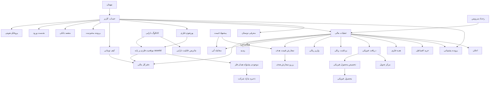
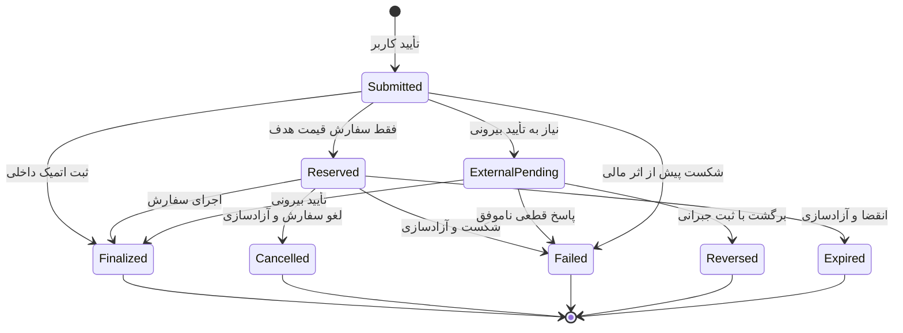

# مدل دامنه و موجودیت‌ها

نسخه: ۰.۴ — ۱۷ مرداد ۱۴۰۵ / 8 Aug 2026
وضعیت: `Sufficient to proceed` — هسته دارایی و قرارداد محصول ارزش‌گذاری/P&L چندفلزی مشخص است؛ تأیید حسابداری فرمول و الگوی دسترسی معامله همچنان Gate مرحله بعدند
زیرمرحله: ۳.۵ اصلاح هدفمند مدل محصول چندفلزی

منابع اصلی: `01-product-definition/multi-metal-impact-map.md`، `capability-map.md`، `roles-and-permissions.md`، `business-rules-source-of-truth.md`، `open-questions.md` و تصمیم‌های D-105 تا D-116.

## ۱. هدف و مرز سند

این سند زبان مشترک محصول، طراحی و فنی درباره چیزهایی است که در شمش وجود دارند، رابطه آن‌ها با هم، وضعیت‌هایشان و منبع حقیقت داده هرکدام. این سند **مدل مفهومی محصول** است، نه طراحی دیتابیس، قرارداد API یا تعهد انتشار همه قابلیت‌ها.

- `Business decision`: دامنه فعلی فقط تجربه کاربر نهایی PWA و Android WebView است؛ ابزارهای ادمین، عملیات و پشتیبانی خارج از Scope تجربه‌اند.
- `Business decision`: واحد پول محصول تومان و واحد معامله/نمایش هر فلز گرم است. Release اول دقیقاً طلا، نقره و مس دارد و مدل باید بدون تغییر ساختار تا حدود ۱۶ دارایی فلزی توسعه‌پذیر باشد — D-106، D-110، D-111.
- `Business decision`: هویت محصول «پلتفرم معتبر چندفلزی» است؛ طلا، نقره و مس در سطح برند هم‌وزن‌اند. قابلیت ریفاینری و ضرب طلا یک مزیت اختصاصی طلاست، نه محور معماری یا هویت — D-105، D-115.
- `Business decision`: هدیه فلزی، خرید اقساطی فلز و معرفی دوستان در مدل دامنه حضور دارند؛ تا Review `Feature × Asset` هیچ‌یک به یک فلز خاص محدود یا برای همه فلزها فعال فرض نمی‌شود — D-127/OQ-054.
- `Business decision`: انتقال کاربر‌به‌کاربر برای هیچ فلزی در نسخه فعلی وجود ندارد؛ فقط سوابق قدیمی احتمالی به‌صورت خواندنی حفظ می‌شوند — D-087، D-114.
- `Risk`: قواعد تازه حقوقی و خزانه‌داری ممکن است بر کیف، روش‌های بانکی و تحویل فیزیکی اثر بگذارد؛ OQ-045 باید پیش از نهایی‌شدن مدل بررسی شود.

## ۲. اصول مدل‌سازی

1. **وضعیت کاربر یک فیلد واحد نیست.** دسترسی کاربر از ترکیب ورود، احراز هویت، اعتبار نشست و محدودیت حساب به‌دست می‌آید.
2. **دفترکل منبع حقیقت مالی است.** کیف تومانی و موقعیت‌های فلزی نمایی قابل‌فهم از حساب‌های دفترکل‌اند، نه منبع مستقل موجودی.
3. **هر داده فلزی باید `assetId` داشته باشد.** نام، آیکن، ترتیب، دقت، گرید و قابلیت‌ها از کاتالوگ دارایی خوانده می‌شوند و در منطق یا UI هاردکد نمی‌شوند.
4. **رزرو فقط برای سفارش قیمت هدف است.** پس از تأیید سفارش خرید، تومان و پس از تأیید سفارش فروش، همان فلز رزرو می‌شود؛ سایر عملیات رزرو ندارند و اثر مالی‌شان در نقطه قطعی همان subtype ثبت می‌شود.
5. **اصلاح با رکورد جدید انجام می‌شود.** تراکنش و سند مالی نهایی حذف یا بازنویسی نمی‌شود؛ اصلاح باید با ثبت جبرانی قابل‌ردیابی باشد.
6. **وضعیت‌های نمایشی نوع‌محورند.** وضعیت یک برداشت با وضعیت تحویل فیزیکی یکی نیست؛ چرخه عمومی فقط برای هماهنگی داخلی استفاده می‌شود.
7. **موارد باز، واقعیت محصول نیستند.** هرجا قانون قطعی نداریم، موجودیت یا رابطه با `Open question` یا `Design assumption` مشخص شده است.

## ۳. نمای مفهومی

این نمودار وابستگی مفهومی را نشان می‌دهد، نه کاردینالیتی دیتابیس.

## ۴. مدل هویت و دسترسی

وضعیت بازبینی: تأییدشده توسط مالک محصول — D-078

### ۴.۱ ابعاد مستقل دسترسی

| بُعد | مقادیر | اثر اصلی |
|---|---|---|
| حضور حساب | مهمان / کاربر واردشده | مهمان حساب مالی و کیف ندارد. |
| احراز هویت | احرازنشده / تأییدشده | عملیات مالی فعال فقط برای کاربر تأییدشده مجاز است؛ انتقال هیچ فلزی در نسخه فعلی فعال نیست. |
| نشست | معتبر / منقضی | نشست پس از سه ساعت بی‌فعالیتی منقضی، با فعالیت معتبر تمدید و ورود دوباره با رمز انجام می‌شود. |
| اهلیت سنی | نامشخص / زیر ۱۸ / مجاز | زیر ۱۸ سال حساب و مشاهده دارد، اما تمام عملیات مالی تا ۱۸سالگی قفل است. |
| محدودیت | بدون محدودیت / محدودیت یک عملیات / محدودیت همه عملیات مالی / قفل ورود | دسترسی مؤثر مطابق کمترین سطح دسترسی مجاز محاسبه می‌شود. |

`Business decision`: «کاربر احرازنشده» وضعیت حساب است، اما Guest موجودیت مستقل پایدار نیست و فقط یک context پیش از ساخت/ورود به حساب است.

### ۴.۲ موجودیت‌های هویت و دسترسی

| موجودیت | تعریف و داده‌های کلیدی | رابطه اصلی | وضعیت / منبع حقیقت |
|---|---|---|---|
| `UserAccount` | شناسه پایدار کاربر، موبایل اصلی، زمان ایجاد | یک پروفایل هویتی، یک اعتبارنامه رمز، چند نشست، حداکثر پنج مقصد بانکی | `Business decision`؛ سرویس حساب |
| `InternalAccountNumber` | شماره حساب داخلی یکتای کاربر برای شناسایی حساب در اسناد داخلی و قابلیت‌های آینده | دقیقاً متعلق به یک حساب؛ نمایش در رسید انتقال فعلاً موضوعیت ندارد | سرویس حساب |
| `IdentityProfile` | کد ملی، تاریخ تولد و نتیجه تطبیق با شماره موبایل | دقیقاً متعلق به یک حساب | احرازنشده / تأییدشده؛ سرویس احراز |
| `PasswordCredential` | اعتبارنامه رمز و زمان ایجاد/تغییر؛ خود رمز خام جزء مدل محصول و داده قابل‌نمایش نیست | دقیقاً متعلق به یک حساب | تنظیم‌نشده / فعال / نیازمند بازیابی؛ سرویس هویت |
| `AuthSession` | نشست ورود، دستگاه، آخرین فعالیت معتبر و زمان انقضای سه‌ساعته | چند نشست مستقل برای یک حساب | معتبر / منقضی / خاتمه‌یافته؛ سرویس هویت |
| `BankInstrument` | کارت یا شبا ثبت‌شده متعلق به کاربر و داده لازم برای واریز/برداشت | حداکثر مجموعاً پنج کارت و شبا برای هر حساب | فعال / غیرفعال؛ مالکیت باید با کد ملی کنترل شود |
| `RestrictionCase` | علت، سطح، دامنه عملیات، شروع، پایان، مرجع و توضیح قابل‌نمایش | صفر یا چند پرونده برای حساب | فعال / رفع‌شده؛ ریسک، دستور قانونی، سوءاستفاده یا شرایط حقوقی |
| `ConsentRecord` | نسخه شرایط، زمان و کانال پذیرش | متعلق به حساب و نسخه سند | `Open question`: نوع اسناد و الزام پذیرش مجدد هنوز زیر OQ-026 قطعی نیست |

### ۴.۳ کاتالوگ دارایی و ماتریس قابلیت

| موجودیت | تعریف و داده‌های کلیدی | قاعده اصلی | منبع حقیقت |
|---|---|---|---|
| `AssetDefinition` | `assetId` پایدار، نام فارسی، آیکن رسمی، واحد نمایش، دقت اعشار، ترتیب، گرید/خلوص مرجع و وضعیت بازار | در Release اول سه رکورد طلا، نقره و مس دارد؛ حذف یا افزودن دارایی نباید ساختار صفحه‌ها و دفترکل را عوض کند | کاتالوگ محصول — D-106، D-111، D-112، D-115 |
| `AssetCatalog` | مجموعه نسخه‌دار `AssetDefinition`ها و ترتیب نمایش فعال | ترتیب فعلی طلا، نقره، مس ثابت است اما از داده خوانده می‌شود؛ ظرفیت هدف حدود ۱۶ دارایی است | محصول + فنی — D-111، D-113 |
| `AssetCapability` | `assetId`، کلید قابلیت، وضعیت فعال/غیرفعال، علت یا وابستگی و مقصد اقدام | قابلیت هر فلز مستقل فعال می‌شود؛ غیرفعال‌بودن یک قابلیت به کل فلز یا فلزهای دیگر سرایت نمی‌کند | Capability Map — D-114 |
| `AssetMarketStatus` | وضعیت قیمت، خرید، فروش و علت/بازه اختلال برای یک `assetId` | توقف باید در سطح همان فلز و همان عملیات اعمال شود، مگر اختلال واقعاً سراسری باشد | موتور قیمت/عملیات — D-112 |

### قرارداد Release اول کاتالوگ

| `assetId` مفهومی | نام | واحد UI/معامله | دقت نمایش وزن | ترتیب |
|---|---|---|---|---|
| `gold` | طلا | گرم | ۳ رقم اعشار | ۱ |
| `silver` | نقره | گرم | ۲ رقم اعشار | ۲ |
| `copper` | مس | گرم | بدون اعشار | ۳ |

`Open question`: گرید/خلوص رسمی، حداقل و گام معامله و قواعد گردکردن هر فلز باید از OQ-033/OQ-055 تأیید شوند؛ دقت نمایش بالا به‌تنهایی دقت محاسبات داخلی را تعیین نمی‌کند.

## ۵. هسته مالی و دفترکل

| موجودیت | تعریف و داده‌های کلیدی | قاعده اصلی | منبع حقیقت |
|---|---|---|---|
| `TomanWallet` | نمای تومانی کاربر با «موجودی» و «قابل استفاده» | منفی نمی‌شود؛ رزرو سفارش خرید در محاسبه موجودی قابل استفاده لحاظ می‌شود | دفترکل تومان |
| `MetalPortfolio` | نمای تجمیعی موقعیت‌های فلزی کاربر و ارزش ریالی کل | مجموع وزن فلزها نیست؛ ارزش هر موقعیت جدا محاسبه و سپس ارزش ریالی جمع می‌شود | نمای خواندنی روی دفترکل و قیمت |
| `MetalPosition` | موقعیت کاربر برای یک `assetId` با وزن کل، قابل استفاده، رزروشده، قفل‌شده و زمان Snapshot | برای هر کاربر و فلز حداکثر یک موقعیت مفهومی؛ وزن منفی نمی‌شود | دفترکل همان دارایی |
| `PositionCostBasis` | Cost Basis باقی‌مانده و میانگین موزون منتخب محصول برای یک `userId × assetId` همراه `basisStatus` و `formulaVersion` | مستقل از فلزهای دیگر؛ اعتبار روش، اجزای هزینه و رویدادهای ویژه منتظر تأیید مالی/حسابداری است | موتور Cost Basis + Ledger + OQ-055 |
| `PortfolioValuation` | «ارزش تقریبی فروش» هر Position با نرخ جاری خرید از کاربر، ارزش کل فلزها، مبلغ/درصد P&L تحقق‌نیافته و P&L تحقق‌یافته جدا | کیف تومان خارج جمع است؛ نرخ ناقص، ردیف را ناموجود و کل را «برآورد ناقص» می‌کند؛ زمان نرخ در داده حفظ ولی در خانه نمایش داده نمی‌شود | موتور ارزش‌گذاری + D-116 + OQ-055 |
| `LedgerAccount` | حساب داخلی با `ownerId`، `assetId` یا واحد تومان و نقش قابل استفاده/رزروشده/درراه/مسدود/اصلاح | هر حساب دقیقاً یک واحد دارد؛ رویدادهای دو فلز در یک حساب مخلوط نمی‌شوند | سامانه دفترکل |
| `LedgerEntry` | ثبت تغییرناپذیر بدهکار/بستانکار با `assetId`/تومان، مقدار، زمان، مرجع عملیات و شناسه همبستگی | هر مجموعه ثبت در واحد خودش تراز است؛ حذف و ویرایش ممنوع | سامانه دفترکل |
| `BalanceReservation` | قفل موقت تومان یا وزن یک `assetId` فقط برای سفارش قیمت هدف تأییدشده | با اجرای سفارش مصرف و با شکست، لغو یا انقضا آزاد می‌شود | سامانه دفترکل |
| `LockedMetalPosition` | بخشی از یک `MetalPosition` که به علت قرارداد یا حکم محصول قابل معامله/تحویل نیست | رزرو سفارش نیست؛ در Release اول نمونه فعال آن طلای قرارداد اقساطی است | دفترکل دارایی + قرارداد مربوط |
| `FinancialOperation` | پوسته مشترک داخلی با نوع، `assetId` در عملیات فلزی، مبلغ/وزن، کارمزد، مالک، زمان و شناسه همبستگی | چرخه داخلی دارد؛ وضعیت نمایشی از subtype می‌آید | هماهنگ‌کننده تراکنش |
| `Receipt` | سند قابل پیگیری شامل فلز، نوع خرید/فروش، وزن، نرخ هر گرم، مبلغ ناخالص، کارمزد، مالیات در صورت وجود، مبلغ نهایی، زمان و کد پیگیری | رسید نهایی فقط بعد از نهایی‌شدن؛ گرید/خلوص در جزئیات ثبت می‌شود | سامانه اسناد مالی — D-115 |
| `FinancialAdjustment` | ادعا، اختلاف یا اصلاح مانده با علت، مرجع، تأییدکننده و ثبت جبرانی | هر اصلاح یک تراکنش جدید است | دفترکل + کنترل مالی |
| `BusinessRuleConfig` | حدود، کارمزدها، دقت، زمان‌ها و قواعد فعال | نسخه جاری از پنل مدیریت؛ الزام ثبت نسخه قاعده روی تراکنش فعلاً وجود ندارد | `Business decision`؛ مالک بیزینس؛ `Risk` حسابرسی نسخه قواعد |

### ۵.۱ ناورداهای مالی

- `Business decision`: واحد ریالی تومان و واحد نمایش/معامله هر سه فلز گرم است؛ دقت نمایش وزن طلا ۳، نقره ۲ و مس ۰ رقم اعشار است — D-110، D-112.
- `Open question`: دقت داخلی، حداقل/گام معامله و گردکردن هر فلز باید مستقل تعریف شود؛ باقیمانده تومانی معامله به کیف تومانی برمی‌گردد — OQ-033/OQ-055.
- `Business decision`: تمام هزینه‌ها پیش از تأیید نشان داده می‌شوند؛ فقط سفارش قیمت هدف دارایی را پس از تأیید رزرو می‌کند.
- `Business decision`: هیچ کیف یا موقعیت پایه‌ای منفی نمی‌شود و خود کیف سود یا بازده تولید نمی‌کند. نمایش سود/زیان یک محاسبه تحلیلی است، نه ثبت موجودی؛ خانه P&L تحقق‌نیافته فعلی را به مبلغ و درصد و جزئیات P&L تحقق‌یافته را جدا نشان می‌دهد — D-113، D-116، OQ-055.
- `Business decision`: سقف‌ها با کد ملی محاسبه می‌شوند؛ عملیات ناموفق، لغوشده یا برگشتی سهمیه را آزاد می‌کند.
- `Business decision`: زمان مرجع محاسبه سقف‌ها منطقه زمانی ایران است.
- `Business decision`: قطعیت مالی فقط پس از ثبت داخلی نهایی و دریافت تأییدهای بیرونی لازم ایجاد می‌شود.
- `Business decision`: محدودیت حساب، فوت کاربر یا تعطیلی سرویس مالکیت دارایی را از بین نمی‌برد.

## ۶. قیمت و معامله فلزها

| موجودیت | تعریف و داده‌های کلیدی | وضعیت یا قاعده | منبع حقیقت / وابستگی |
|---|---|---|---|
| `PriceSnapshot` | `assetId`، قیمت خرید و فروش معتبر هر گرم، زمان تولید/انقضا، منبع و وضعیت | Snapshot و اختلال هر فلز مستقل است؛ زمان به‌روزرسانی در UI خانه نمایش داده نمی‌شود | موتور قیمت؛ فرمول و منابع OQ-020/OQ-055 |
| `TradeQuote` | `assetId`، جهت خرید/فروش، ورودی تومان یا گرم، وزن، نرخ، کارمزد/مالیات، مبلغ نهایی و زمان اعتبار | تا لحظه تأیید خودکار به‌روز می‌شود؛ رقم هنگام تأیید نهایی است | موتور قیمت + قواعد همان فلز |
| `InstantTrade` | خرید یا فروش آنی یک `assetId` با Quote مشخص | درحال نهایی‌سازی / موفق / ناموفق | هماهنگ‌کننده معامله |
| `TargetOrder` | دستور خرید یا فروش یک `assetId` در قیمت هدف با مقدار و تاریخ انقضا | فقط برای فلزهایی که Capability آن فعال شود؛ قواعد هر فلز در OQ-054 باز است | موتور سفارش + `AssetCapability` |
| `PriceAlert` | شرط اعلان قیمت برای یک `assetId` بدون اجازه اجرای معامله | برای طلا، نقره و مس فعال؛ فعال / تحریک‌شده / خاموش / منقضی | سرویس اعلان — D-114 |

`Business decision`: نوسان به‌تنهایی معامله را متوقف نمی‌کند؛ توقف فقط وقتی مجاز است که قیمت معتبر وجود نداشته باشد یا ثبت الزامی معامله ممکن نباشد.

### ۶.۱ چرخه معامله آنی

| از | رخداد | به | اثر مالی |
|---|---|---|---|
| پیش‌نمایش | تأیید کاربر با Quote معتبر و جاری | درحال نهایی‌سازی | بدون رزرو؛ عملیات برای ثبت اتمیک ارسال می‌شود |
| درحال نهایی‌سازی | ثبت نهایی داخلی و تأییدهای لازم | موفق | ثبت قطعی دفترکل و صدور رسید نهایی |
| درحال نهایی‌سازی | شکست قطعی پیش از ثبت مالی | ناموفق | بدون تغییر موجودی و با نتیجه قابل‌پیگیری |

### ۶.۲ چرخه سفارش قیمت هدف

- پیش از تأیید، سفارش پایدار و وضعیت Draft وجود ندارد.
- با تأیید سفارش خرید، تومان و با تأیید سفارش فروش، وزن همان `assetId` رزرو می‌شود.
- سفارش قابل ویرایش نیست؛ برای تغییر باید لغو و سفارش تازه ساخته شود.
- سفارش یا «تا اجرا/لغو» فعال می‌ماند یا تاریخ انقضای مشخص دارد.
- اجرا فقط کامل و در قیمت هدف یا بهتر است؛ در شکست، لغو یا انقضا رزرو خودکار آزاد می‌شود.

## ۷. ورود و خروج پول

| موجودیت | تعریف و داده‌های کلیدی | وضعیت‌های کاربر | منبع حقیقت / وابستگی |
|---|---|---|---|
| `Deposit` | واریز ریالی از درگاه، کارت‌به‌کارت، پل، پایا یا Open Banking | درحال تطبیق / شارژشده / ناموفق / برگشتی | بانک + تطبیق داخلی |
| `HighValueDepositRequest` | مسیر اختصاصی برای مبالغ کلان | `Open question`: وضعیت و عملیات نامشخص | OQ-031 |
| `Withdrawal` | درخواست انتقال از کیف تومانی به شبای ثبت‌شده | ثبت‌شده / درحال بررسی / ارسال‌شده به بانک / واریزشده / ناموفق / برگشتی | دفترکل + بانک |

### ۷.۱ قواعد واریز

- حداقل واریز ۱۰٬۰۰۰ تومان است؛ سقف‌ها بسته به روش و قواعد جاری متفاوت‌اند.
- کاربر باید از کارت‌های ثبت‌شده خودش واریز کند.
- برداشت بانکی از حساب کاربر که هنوز نتیجه قطعی آن به محصول نرسیده، در وضعیت «درحال تطبیق» باقی می‌ماند و نباید شارژ قطعی نمایش داده شود.
- تطبیق دستی فقط توسط مالک بیزینس و بر اساس رسید واریز انجام می‌شود.

### ۷.۲ چرخه برداشت

| از | رخداد | به | اثر مالی |
|---|---|---|---|
| پیش‌نمایش | تأیید نهایی کاربر | ثبت‌شده | بدون رزرو؛ مبلغ به‌صورت قطعی از موجودی قابل استفاده کسر می‌شود و کاربر دیگر امکان لغو ندارد |
| ثبت‌شده | ورود به کنترل داخلی | درحال بررسی | مبلغ کسرشده در انتظار نتیجه بانکی است |
| ثبت‌شده/درحال بررسی | ارسال دستور بانکی | ارسال‌شده به بانک | وضعیت عملیات به‌روزرسانی می‌شود |
| ارسال‌شده به بانک | تأیید پرداخت | واریزشده | رسید نهایی و کد پیگیری |
| پیش از ارسال بانکی | شکست قطعی | ناموفق | مبلغ با ثبت جبرانی به کیف برمی‌گردد |
| پس از ارسال بانکی | رد بانک یا برگشت وجه | برگشتی | ثبت جبرانی و بازگشت مبلغ مطابق SLA مصوب |

قواعد فعلی برداشت: حداقل ۲۰۰٬۰۰۰ تومان، بدون کارمزد، حداکثر هر برداشت ۳۰۰ میلیون تومان، سقف روزانه ۳۰۰ میلیون تومان و سقف ماهانه ۶ میلیارد تومان.

## ۸. کنترل منفی انتقال دارایی

`Business decision`: هیچ‌کدام از فلزهای Release اول انتقال کاربر‌به‌کاربر یا شناسه دریافت ندارند؛ قابلیت انتقال در UI، ناوبری، Capability Map و مدل اجرایی ساخته نمی‌شود — D-087، D-114.

- هیچ مسیر انتقال فلز به شماره موبایل، کاربر دیگر یا کیف دیگر نمایش داده نمی‌شود.
- سوابق انتقال قدیمی، اگر وجود داشته باشند، فقط می‌توانند در تاریخچه به‌صورت خواندنی باقی بمانند.
- هر بازگشت آینده انتقال نیازمند تصمیم تازه بیزینسی، حقوقی، نظارتی، مالی و طراحی موجودیت‌های مستقل است؛ موجودیت فرضی انتقال از هسته Release اول حذف شده است.

## ۹. مالکیت، پشتوانه و دریافت فیزیکی

| موجودیت | تعریف و داده‌های کلیدی | قاعده اصلی | منبع حقیقت / وابستگی |
|---|---|---|---|
| `MetalPosition` | مالکیت قطعی کاربر از یک `assetId` به گرم | هم‌زمان با ثبت نهایی معامله تغییر می‌کند؛ متعلق به کاربر است و با محدودیت حساب از بین نمی‌رود | دفترکل دارایی + سامانه ناظر |
| `UserBackingInventory` | بخش واقعی موجودی هر فلز که تعهد موقعیت‌های کاربران را پوشش می‌دهد | برای هر `assetId` باید حداقل برابر مجموع موقعیت‌های کاربران باشد | خزانه/متولی + OQ-019/OQ-026 |
| `CompanyReservePosition` | موجودی واقعی مازاد همان فلز که بالاتر از تعهد کاربران نگهداری می‌شود | دارایی شرکت است و هرگز در موجودی یا مالکیت کاربران نمایش داده نمی‌شود | D-107، D-108؛ سیاست داخلی OQ-057 |
| `BackingCoverageSnapshot` | مجموع موقعیت کاربران، پشتوانه کاربری، ذخیره مازاد و نسبت پوشش برای یک `assetId` در یک زمان | نسبت موجودی واقعی کل به تعهد کاربران برای طلا، نقره و مس بیش از ۱۰۰٪ است | مالی/خزانه؛ جزئیات داخلی OQ-057 |
| `ReconciliationReport` | نتیجه تطبیق دفترکل با موجودی ناظر/خزانه به تفکیک `assetId` | تناوب، مالک و کنترل مستقل خارج از طراحی تجربه و در OQ-057 باز است | مالی/عملیات/فنی |
| `PhysicalProduct` | `assetId`، نوع محصول، وزن، گرید/خلوص، برند/سری، تصویر، وضعیت عرضه و هزینه‌های وابسته | کاتالوگ فیزیکی هر فلز مستقل است؛ نام فلز سطح اول و گرید در جزئیات می‌آید | عملیات ضرب/تأمین و موجودی — D-115 |
| `DeliveryCenter` | مرکز تحویل با نشانی، ساعات، ظرفیت و فلز/محصول‌های قابل تحویل | فقط مرکز فعال و سازگار با محصول انتخاب می‌شود | عملیات فیزیکی |
| `PhysicalRedemption` | درخواست تبدیل وزن یک `assetId` به محصول فیزیکی مشخص | برای هر سه فلز فعال؛ ثبت‌شده / درحال آماده‌سازی / آماده تحویل / ارسال‌شده / تحویل‌شده / لغوشده / ناموفق | هماهنگ‌کننده تحویل — D-114 |
| `PhysicalAllocation` | اتصال درخواست به محصول/سری فیزیکی و سند مالکیت یا تحویل | پس از تأیید نهایی و تخصیص واقعی همان فلز ایجاد می‌شود | عملیات فیزیکی + دفترکل |

### ۹.۱ چرخه مالکیت تا تحویل

1. معامله موفق، `MetalPosition` همان `assetId` را افزایش می‌دهد؛ پشتوانه هر فلز جداگانه و تجمیعی نگهداری می‌شود.
2. ثبت اولیه درخواست هیچ رزرو یا اثر مالی ایجاد نمی‌کند.
3. با تأیید نهایی، وزن لازم بدون رزرو از بخش قابل استفاده `MetalPosition` همان فلز کسر می‌شود.
4. با تخصیص محصول مشخص، `PhysicalAllocation` و سند مربوط ساخته می‌شود.
5. تحویل موفق، رسید تحویل نهایی ایجاد می‌کند؛ لغو یا شکست پس از تأیید با ثبت جبرانی همان وزن و همان `assetId` را برمی‌گرداند و هزینه‌های واقعاً مصرف‌شده جداگانه تعیین تکلیف می‌شوند.

`Open question`: آخرین نقطه مجاز لغو، هزینه‌های غیرقابل‌بازگشت، روش ارسال، وزن‌ها، مدارک تحویل، SLA و مسئولیت خسارت در OQ-003 هنوز بازند.

## ۱۰. پشتیبانی، اختلال و اعلان

| موجودیت | تعریف و داده‌های کلیدی | رابطه / وضعیت | منبع حقیقت |
|---|---|---|---|
| `SupportCase` | پرونده درخواست، اختلاف یا شکایت کاربر با موضوع، اولویت و عملیات مرتبط | باز / درحال پیگیری / حل‌شده / بسته؛ وضعیت‌ها `Design assumption` | سامانه پشتیبانی |
| `ServiceIncident` | اختلال قیمت، بانک، ناظر، دفترکل یا تحویل با بازه و دامنه اثر | فعال / رفع‌شده؛ وضعیت‌ها `Design assumption` | پایش سرویس + عملیات |
| `Notification` | پیام درون‌محصول، Push یا پیامک درباره رخداد مشخص | ایجاد / ارسال / تحویل / ناموفق؛ وضعیت‌ها `Design assumption` | سرویس اعلان |

در اختلال، پیام باید وضعیت دارایی و قدم بعدی را روشن کند و حس سوءاستفاده یا از‌دست‌رفتن دارایی ایجاد نکند. نتیجه عملیات نیمه‌کاره از امکان برگشت آن تعیین می‌شود، نه از یک قانون کلی موفق/ناموفق.

## ۱۱. مدل محدودیت حساب

| سطح | اثر مجاز | دسترسی حفظ‌شده |
|---|---|---|
| محدودیت یک عملیات | فقط قابلیت مشخص مانند برداشت غیرفعال می‌شود | دارایی، تاریخچه و سایر عملیات مجاز |
| محدودیت همه عملیات مالی | خرید، فروش، واریز، برداشت و دریافت فیزیکی متوقف می‌شوند | ورود، مشاهده دارایی، تاریخچه و پشتیبانی |
| قفل ورود | ورود عادی متوقف و مسیر بازیابی/پشتیبانی نمایش داده می‌شود | مالکیت و سوابق حذف نمی‌شوند |

علت‌های مجاز فعلی: خطر امنیتی، رفتار مالی مشکوک، دستور قانونی، سوءاستفاده از محصول و شرایط حقوقی خاص. مشکل عادی احراز هویت یا تقلب فنیِ از قبل مهار‌شده، به‌تنهایی علت مستقل مسدودی محسوب نمی‌شود.

`Business decision`: همیشه کمترین محدودیت لازم اعمال می‌شود. عملیات درحال اجرا اگر هنوز برگشت‌پذیر باشد متوقف و آزاد می‌شود؛ در غیر این صورت تا نتیجه قطعی ادامه و سپس حساب محدود می‌شود.

## ۱۲. چرخه داخلی مشترک عملیات

این چرخه فقط برای هماهنگی فنی و تحلیل است و نباید مستقیماً به کاربر نمایش داده شود.

`Business decision`: وضعیت پیش از تأیید کاربر موجودیت پایدار یا Draft نیست. شاخه `Reserved` فقط متعلق به سفارش قیمت هدف است؛ سایر عملیات مستقیم به ثبت داخلی، انتظار بیرونی یا شکست می‌روند.

### ۱۲.۱ مسیر پایه وضعیت‌های نوع‌محور

نام وضعیت‌ها قطعی است؛ مسیرهای زیر نسخه اولیه Transitionها هستند و جزئیات رخدادهای بانکی، خزانه و عملیات باید با ذی‌نفع مربوط بازبینی شود.

| نوع عملیات | مسیر پایه | شاخه‌های پایانی |
|---|---|---|
| سفارش قیمت هدف | فعال ← تأیید سفارش و رزرو تومان/همان فلز | اجراشده با تحقق شرط و ثبت مالی؛ لغوشده یا منقضی با آزادسازی؛ ناموفق با آزادسازی خودکار |
| واریز | درحال تطبیق واریز ← دریافت شواهد پرداخت | شارژشده پس از ثبت قطعی کیف؛ ناموفق پیش از شارژ؛ برگشتی در صورت بازگشت وجه |
| انتقال فلز | خارج از نسخه فعلی با D-087/D-114 | در نسخه فعلی status کاربر ندارد |
| دریافت فیزیکی حضوری | ثبت‌شده ← تأیید نهایی و کسر قطعی همان فلز | درحال آماده‌سازی ← آماده دریافت ← تحویل‌شده؛ لغو/شکست با ثبت جبرانی |
| دریافت فیزیکی ارسالی | ثبت‌شده ← تأیید نهایی و کسر قطعی همان فلز | درحال آماده‌سازی ← ارسال‌شده ← تحویل‌شده؛ لغو/شکست با ثبت جبرانی |

`Open question`: «لغوشده» و «ناموفق» دریافت فیزیکی با بازگشت همان وزن و همان فلز ثبت می‌شوند، اما آخرین نقطه مجاز لغو و هزینه‌های غیرقابل‌بازگشت تا پاسخ OQ-003 قطعی نیست.

## ۱۳. قابلیت‌های فلزمحور نیازمند Review دامنه فلز

### ۱۳.۱ هدیه فلزی

| موجودیت | تعریف و قاعده قطعی | وابستگی باز |
|---|---|---|
| `GiftCard` | هدیه متصل به `assetId`، مقدار/محصول رسمی همان فلز و یکی از روش‌های تأمین مجاز | دامنه فلز و قواعد per asset؛ OQ-054، فهرست مقدار/محصول و قواعد حقوقی OQ-006 |
| `GiftCardClaim` | ثبت دریافت هدیه در Position همان `assetId` توسط گیرنده احرازشده | روش دریافت، دریافت‌نشده، لغو و تاریخ انقضا؛ OQ-006/OQ-054 |

- قواعد ثبت‌شده قبلی برای وزن ثابت طلا، تأمین از Position طلا/تومان و دریافت کامل، ورودی Legacy برای Review هستند و به فلز دیگر یا قرارداد نهایی تعمیم داده نمی‌شوند.
- گیرنده باید حساب احرازشده داشته باشد؛ نوع مقدار/محصول و امکان دریافت جزئی یا کامل باید در OQ-054/OQ-006 تأیید شود.
- `Open question`: نبود انقضا یا لغو هنوز قانون قطعی نیست و همراه تکلیف کارت دریافت‌نشده در OQ-006 باز می‌ماند.

### ۱۳.۲ خرید اقساطی فلز

| موجودیت | تعریف و قاعده قطعی | وابستگی باز |
|---|---|---|
| `InstallmentContract` | قرارداد مستقیم شمش-کاربر متصل به `assetId` با مقدار، قیمت، دوره، هزینه اولیه، بدهی و برنامه اقساط | دامنه و قواعد per asset در OQ-054؛ منبع اعتبار، اعتبارسنجی/مدارک، قیمت و حقوقی OQ-005/OQ-020/OQ-045 |
| `InstallmentPayment` | هر قسط با مبلغ، سررسید ۳۰روزه، زمان پرداخت، مهلت ۵روزه، جریمه، وضعیت و رخداد فسخ احتمالی | در موعد / پرداخت‌شده / معوق / در جریمه / فسخ‌شده / تسویه‌شده |
| `LockedMetalPosition` | بخش قفل‌شده `MetalPosition` همان `assetId` که تا شرط آزادسازی قرارداد غیرقابل استفاده است | دامنه فلز، آزادسازی و تسویه اجباری تابع Review OQ-054 و قرارداد |

- قواعد قبلی قیمت/وزن قطعی، دوره، جریمه، تسویه و آزادسازی برای قرارداد طلای Legacy حفظ می‌شوند، اما تا Review OQ-054 قرارداد عمومی همه فلزها یا انحصار طلا محسوب نمی‌شوند.
- هر قرارداد باید `assetId` صریح داشته باشد و قفل/آزادسازی/ثبت جبرانی فقط Position همان فلز را تغییر دهد.
- انتقال در نسخه فعلی برای هیچ فلزی فعال نیست.

### ۱۳.۳ معرفی دوستان

| موجودیت | تعریف و قاعده قطعی | وابستگی باز |
|---|---|---|
| `Referral` | اتصال معرف، دعوت‌شونده، کد/لینک و وضعیت تحقق شرط | شرط پاداش، نوع پاداش و ضدسوءاستفاده؛ OQ-026 |

## ۱۴. موجودیت‌های توسعه‌ای و غیرقطعی

| موجودیت | وضعیت محصول | وابستگی اصلی |
|---|---|---|
| `SecuredLoanContract` | خارج از Release اول؛ ممکن در آینده | تصمیم بیرونی و مدل وثیقه |
| `LoyaltyAccount` | اصل باشگاه تأیید، مکانیک و ترتیب عرضه باز | OQ-034 |
| `DiscountCampaign` | پشتیبانی شرطی از کد تخفیف خرید طلا | بودجه، محدودیت و حسابداری؛ OQ-036 |
| `RetentionOffer` | فقط هنگام طراحی فلو فروش ارزیابی می‌شود | OQ-037 |
| `AdditionalAssetDefinition` | افزودن فلز چهارم تا ظرفیت هدف حدود ۱۶، بدون تعهد انتشار | تصمیم مستقل بیزینسی و تکمیل مشخصات/قابلیت همان فلز |

## ۱۵. روابط و کاردینالیتی مفهومی

| مبدأ | رابطه | مقصد |
|---|---|---|
| `UserAccount` | یک‌به‌یک | `IdentityProfile`، `InternalAccountNumber`، `TomanWallet`، `MetalPortfolio` |
| `UserAccount` | یک‌به‌چند | `AuthSession`، `RestrictionCase`، `FinancialOperation`، `Receipt`، `SupportCase` |
| `UserAccount` | صفر تا پنج در مجموع | `BankInstrument` |
| `FinancialOperation` | صفر یا چند | `BalanceReservation`، `LedgerEntry`، `Notification` |
| `FinancialOperation` | صفر یا یک نهایی | `Receipt` |
| `InstantTrade` | دقیقاً یک | `TradeQuote` معتبر در زمان تأیید |
| `AssetCatalog` | یک‌به‌چند | `AssetDefinition` و `AssetCapability`؛ سه دارایی فعال در Release اول |
| `UserAccount` | یک‌به‌چند بر پایه `assetId` | `MetalPosition`؛ حداکثر یک Position برای هر فلز |
| تمام `MetalPosition`های یک فلز | چند‌به‌یک تجمیعی | `UserBackingInventory` همان `assetId` |
| `UserBackingInventory` | یک‌به‌یک در هر Snapshot | `CompanyReservePosition` همان `assetId` به‌عنوان بخش مازاد مستقل |
| `PhysicalRedemption` | یک یا چند | `PhysicalAllocation` و `PhysicalProduct` |
| `GiftCard` | یک صادرکننده، یک گیرنده و یک `assetId` | دو `UserAccount` احرازشده؛ دریافت با یک `GiftCardClaim` |
| `InstallmentContract` | یک‌به‌چند و متصل به یک `assetId` | `InstallmentPayment`؛ یک‌به‌یک با `LockedMetalPosition` همان فلز |
| `Referral` | یک معرف و یک دعوت‌شونده | دو `UserAccount` |
| `SupportCase` | صفر یا یک | `FinancialOperation` یا `ServiceIncident` |

## ۱۶. ماتریس منبع حقیقت و مالک داده

| حوزه داده | منبع حقیقت پیشنهادی/قطعی | مالک پاسخ‌گو | وضعیت |
|---|---|---|---|
| حساب و موبایل | سرویس حساب | محصول + فنی | قطعی در سطح مفهومی |
| احراز هویت | پاسخ سرویس تطبیق + رکورد داخلی | حقوقی/انطباق + فنی | قطعی در سطح مفهومی |
| نشست و OTP | سرویس هویت | امنیت + فنی | قطعی |
| کارت و شبا | رکورد داخلی پس از کنترل مالکیت | مالی + فنی | جزئیات کنترل بانکی باز |
| تعریف، ترتیب، دقت و قابلیت فلزها | `AssetCatalog` و `AssetCapability` نسخه‌دار | محصول + فنی | قرارداد Release اول قطعی؛ گرید/حداقل‌ها باز |
| مانده تومان و موقعیت هر فلز | دفترکل داخلی بر پایه `assetId` | مالی + فنی | قطعی در سطح مفهومی |
| وضعیت شبکه بانکی | پاسخ بانک/PSP و تطبیق داخلی | مالی/عملیات | قواعد شکست و SLA کامل باز |
| قیمت و Quote | موتور قیمت | مالک بیزینس + مالی | منبع و فرمول OQ-020 باز |
| مالکیت فلزی کاربر | `MetalPosition` مشتق از دفترکل + ثبت ناظر | مالی/حقوقی | اصل مالکیت واقعی هر سه فلز قطعی؛ سازوکار فنی باز |
| پشتوانه و ذخیره مازاد هر فلز | سامانه خزانه/متولی به تفکیک `assetId` | مالی/عملیات/حقوقی | پوشش بیش از ۱۰۰٪ و مالکیت شرکت بر مازاد قطعی؛ جزئیات OQ-057 باز |
| محصول و تحویل فیزیکی | عملیات ضرب و تحویل | عملیات | جزئیات OQ-003 باز |
| قوانین و حدود | پنل مدیریت تحت مالکیت بیزینس | مالک بیزینس | نسخه‌بندی حسابرسی نیازمند بررسی |
| رسید نهایی | سامانه اسناد مالی بر پایه دفترکل | مالی + فنی | قطعی در سطح مفهومی |
| هدیه و دریافت | سرویس هدیه متصل به Position همان `assetId` | محصول + مالی + فنی | دامنه فلز OQ-054؛ قواعد OQ-006 باز |
| قرارداد، اقساط و موقعیت طلای قفل‌شده | سرویس اقساط + دفترکل دارایی | بیزینس + مالی + حقوقی | توسعه به نقره/مس تصمیم مستقل؛ OQ-054 |
| معرفی و پاداش | سرویس رشد متصل به حساب و دفترکل پاداش | رشد + مالی + فنی | اصل قابلیت قطعی؛ مکانیک باز |

## ۱۷. وابستگی‌های باز مؤثر بر مدل

| موضوع | موجودیت‌های متأثر | مرجع | اثر بر نهایی‌شدن |
|---|---|---|---|
| فرمول قیمت، spread، حداقل/گام و رفتار شکست هر فلز | `AssetDefinition`، `PriceSnapshot`، `TradeQuote`، معاملات | OQ-020/OQ-033/OQ-055 | محاسبه، گردکردن و ثبت نرخ |
| تأیید حسابداری Cost Basis، مقدار مبنای ارزش، هزینه/مالیات، دقت و رویدادهای ویژه | `PortfolioValuation`، `PositionCostBasis`، `MetalPosition` | D-116، OQ-055 | Gate صحت فرمول نهایی پورتفوی Release اول؛ قرارداد محصول بسته است |
| الگوی دسترسی معامله/نمودار برای ۳ تا ۱۶ فلز | IA، صفحه معامله و نمودار | OQ-058 | Gate پیش از اصلاح معماری و Prototype فلزمحور |
| جزئیات شکست و بازیابی بانکی | `Deposit`، `Withdrawal` | OQ-021 / OQ-026 | Transition، SLA و اصلاح مالی |
| خزانه، ذخیره مازاد و تطبیق داخلی | `UserBackingInventory`، `CompanyReservePosition`، `ReconciliationReport` | OQ-019/OQ-026/OQ-057 | خارج از طراحی UX؛ مالک داده و کنترل پوشش |
| قواعد مسیر واریز کلان | `HighValueDepositRequest` | OQ-031 | موجودیت و چرخه مستقل |
| انتقال فلز | کنترل منفی Scope | D-087/D-114 | برای هیچ فلزی ساخته نمی‌شود |
| عملیات دریافت فیزیکی سه فلز | `PhysicalProduct`، `PhysicalRedemption` و تخصیص | OQ-003/OQ-033/OQ-045 | کاتالوگ، گرید، هزینه، وضعیت‌ها، اسناد و SLA |
| دامنه فلز و قواعد هدیه دریافت‌نشده، لغو و انقضا | `GiftCard`، `GiftCardClaim` | OQ-006/OQ-054 | وضعیت‌های نهایی و اثر همان `assetId` |
| قرارداد، منبع اعتبار، اعتبارسنجی/مدارک، منبع قیمت و تسویه زودهنگام اقساط | `InstallmentContract`، `InstallmentPayment`، `LockedMetalPosition` | OQ-005، OQ-020، OQ-045 | Gate قبل UI نهایی |
| اثر ضوابط حقوقی جدید | کیف‌ها، بانکی و خزانه | OQ-045 | ممکن است مرز یا اجازه قابلیت‌ها را تغییر دهد |
| ترتیب عرضه سایر قابلیت‌ها | موجودیت‌های توسعه‌ای | OQ-025 | کارت هدیه، اقساط و معرفی در Release اول قطعی‌اند؛ ترتیب باقی قابلیت‌ها باز است |

## ۱۸. معیار بازبینی نسخه ۰.۳

- [x] `AssetDefinition`، `AssetCatalog`، `AssetCapability` و قرارداد توسعه از ۳ تا حدود ۱۶ فلز تعریف شده‌اند.
- [x] `MetalPosition`، Ledger، Quote، Order، Receipt، پشتوانه و دریافت فیزیکی بر پایه `assetId` بازطراحی شده‌اند.
- [x] طلا، نقره و مس با دقت نمایش مستقل و ترتیب داده‌محور ثبت شده‌اند.
- [x] انتقال برای همه فلزها کنترل منفی Scope و تحویل فیزیکی هر سه فلز مدل شده است؛ هدیه تا OQ-054 تک‌فلزی فرض نمی‌شود.
- [x] روابط کلیدی و منبع حقیقت اولیه مشخص شده‌اند.
- [x] وضعیت‌های کاربرمحور قطعی از چرخه داخلی عمومی جدا شده‌اند.
- [x] مرز رزرو سفارش، قفل اقساط، نهایی‌شدن، برگشت و اصلاح مالی مدل شده است.
- [ ] دامنه قابلیت‌های فلزمحور در Review `Feature × Asset` تعیین شود؛ هیچ قابلیت اختصاصی یک فلز پیش از D-127 ثبت نمی‌شود.
- [x] تصمیم‌های D-105 تا D-116 در مدل اعمال شده‌اند.
- [ ] مرز موجودیت‌ها با تیم فنی و مالی بازبینی شود.
- [ ] منبع حقیقت قیمت، بانک، خزانه و عملیات فیزیکی تأیید شود.
- [ ] Transitionهای دقیق رخدادهای خطا و اختلال تأیید شوند.
- [ ] انطباق حقوقی مدل کیف و پشتوانه تأیید شود؛ انتقال در نسخه فعلی حذف شده است.

## نتیجه Gate این زیرمرحله

`Sufficient to proceed` برای هسته مشترک — قرارداد دارایی، Position، دفترکل، معامله، رسید، پشتوانه، تحویل و معنای محصولی ارزش/P&L برای سه فلز و ظرفیت حدود ۱۶ فلز تعریف شده است. Domain هدیه/اقساط برای دامنه `Feature × Asset` زیر OQ-054 `Needs revision` است. OQ-058/OQ-059 بسته‌اند؛ OQ-055 فقط UI نهایی عددهای پورتفوی را متوقف می‌کند.
