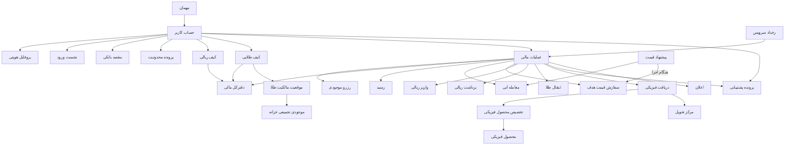
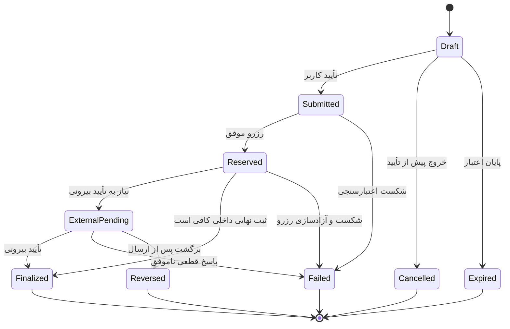

# مدل دامنه و موجودیت‌ها

نسخه: ۰.۱ — ۲۸ تیر ۱۴۰۵ / 19 Jul 2026  
وضعیت: `Needs revision` — نسخه اولیه برای بازبینی مالک محصول، فنی، مالی، حقوقی و عملیات  
زیرمرحله: ۳.۴ مدل محصول، فعال پس از D-077

منابع اصلی: `capability-map.md`، `roles-and-permissions.md`، `business-rules-source-of-truth.md`، `open-questions.md` و تصمیم‌های D-051 تا D-077.

## ۱. هدف و مرز سند

این سند زبان مشترک محصول، طراحی و فنی درباره چیزهایی است که در شمش وجود دارند، رابطه آن‌ها با هم، وضعیت‌هایشان و منبع حقیقت داده هرکدام. این سند **مدل مفهومی محصول** است، نه طراحی دیتابیس، قرارداد API یا تعهد انتشار همه قابلیت‌ها.

- `Business decision`: دامنه فعلی فقط تجربه کاربر نهایی PWA و Android WebView است؛ ابزارهای ادمین، عملیات و پشتیبانی خارج از Scope تجربه‌اند.
- `Business decision`: دارایی فعلی محصول فقط طلای ۱۸ عیار و ریال است؛ چندفلزی یک جهت آینده است، نه بخشی از مدل اجرایی فعلی.
- `Design assumption`: موجودیت‌های قابلیت‌های آینده فقط برای جلوگیری از بن‌بست معماری ثبت می‌شوند و حضورشان به معنی تأیید انتشار نیست.
- `Risk`: قواعد تازه حقوقی و خزانه‌داری ممکن است بر کیف، انتقال کاربر‌به‌کاربر، روش‌های بانکی و تحویل فیزیکی اثر بگذارد؛ OQ-045 باید پیش از نهایی‌شدن مدل بررسی شود.

## ۲. اصول مدل‌سازی

1. **وضعیت کاربر یک فیلد واحد نیست.** دسترسی کاربر از ترکیب ورود، احراز هویت، اعتبار نشست و محدودیت حساب به‌دست می‌آید.
2. **دفترکل منبع حقیقت مالی است.** کیف ریالی و طلایی نمایی قابل‌فهم از حساب‌های دفترکل‌اند، نه منبع مستقل موجودی.
3. **رزرو، دارایی را منتقل نمی‌کند.** با تأیید کاربر مبلغ یا طلا رزرو می‌شود؛ نهایی‌شدن فقط پس از ثبت داخلی و تأییدهای لازم بیرونی رخ می‌دهد.
4. **اصلاح با رکورد جدید انجام می‌شود.** تراکنش و سند مالی نهایی حذف یا بازنویسی نمی‌شود؛ اصلاح باید با ثبت جبرانی قابل‌ردیابی باشد.
5. **وضعیت‌های نمایشی نوع‌محورند.** وضعیت یک برداشت با وضعیت تحویل فیزیکی یکی نیست؛ چرخه عمومی فقط برای هماهنگی داخلی استفاده می‌شود.
6. **موارد باز، واقعیت محصول نیستند.** هرجا قانون قطعی نداریم، موجودیت یا رابطه با `Open question` یا `Design assumption` مشخص شده است.

## ۳. نمای مفهومی

این نمودار وابستگی مفهومی را نشان می‌دهد، نه کاردینالیتی دیتابیس.

## ۴. مدل هویت و دسترسی

وضعیت بازبینی: تأییدشده توسط مالک محصول — D-078

### ۴.۱ ابعاد مستقل دسترسی

| بُعد | مقادیر | اثر اصلی |
|---|---|---|
| حضور حساب | مهمان / کاربر واردشده | مهمان حساب مالی و کیف ندارد. |
| احراز هویت | احرازنشده / تأییدشده | عملیات انتقال پول یا طلا فقط برای کاربر تأییدشده مجاز است. |
| نشست | معتبر / منقضی | نشست پس از ۲۴ ساعت از آخرین OTP موفق منقضی و ورود دوباره لازم می‌شود. |
| محدودیت | بدون محدودیت / محدودیت یک عملیات / محدودیت همه عملیات مالی / قفل ورود | دسترسی مؤثر مطابق کمترین سطح دسترسی مجاز محاسبه می‌شود. |

`Business decision`: «کاربر احرازنشده» وضعیت حساب است، اما Guest موجودیت مستقل پایدار نیست و فقط یک context پیش از ساخت/ورود به حساب است.

### ۴.۲ موجودیت‌های هویت و دسترسی

| موجودیت | تعریف و داده‌های کلیدی | رابطه اصلی | وضعیت / منبع حقیقت |
|---|---|---|---|
| `UserAccount` | شناسه پایدار کاربر، موبایل اصلی، زمان ایجاد | یک پروفایل هویتی، چند نشست، حداکثر پنج مقصد بانکی | `Business decision`؛ سرویس حساب |
| `IdentityProfile` | کد ملی، تاریخ تولد و نتیجه تطبیق با شماره موبایل | دقیقاً متعلق به یک حساب | احرازنشده / تأییدشده؛ سرویس احراز |
| `AuthSession` | نشست ورود، دستگاه، زمان OTP موفق و انقضا | چند نشست برای یک حساب | معتبر / منقضی / خاتمه‌یافته؛ سرویس هویت |
| `BankInstrument` | کارت یا شبا ثبت‌شده متعلق به کاربر و داده لازم برای واریز/برداشت | حداکثر مجموعاً پنج کارت و شبا برای هر حساب | فعال / غیرفعال؛ مالکیت باید با کد ملی کنترل شود |
| `RestrictionCase` | علت، سطح، دامنه عملیات، شروع، پایان، مرجع و توضیح قابل‌نمایش | صفر یا چند پرونده برای حساب | فعال / رفع‌شده؛ ریسک، دستور قانونی، سوءاستفاده یا شرایط حقوقی |
| `ConsentRecord` | نسخه شرایط، زمان و کانال پذیرش | متعلق به حساب و نسخه سند | `Open question`: نوع اسناد و الزام پذیرش مجدد هنوز زیر OQ-026 قطعی نیست |

## ۵. هسته مالی و دفترکل

| موجودیت | تعریف و داده‌های کلیدی | قاعده اصلی | منبع حقیقت |
|---|---|---|---|
| `RialWallet` | نمای ریالی کاربر با «موجودی» و «قابل استفاده» به تومان | منفی نمی‌شود؛ مانده رزروشده داخل محاسبه است ولی به کاربر عدد جدا نشان داده نمی‌شود | دفترکل ریالی |
| `GoldWallet` | نمای طلای ۱۸ عیار با «موجودی» و «قابل استفاده» به گرم | دقت داخلی و نمایشی سه رقم اعشار؛ حداقل و گام یک سوت | دفترکل طلا |
| `LedgerAccount` | حساب داخلی برای دارایی قابل استفاده، رزروشده، در راه، مسدود یا اصلاحات | هر حساب یک واحد و مالک مشخص دارد | سامانه دفترکل |
| `LedgerEntry` | ثبت تغییرناپذیر بدهکار/بستانکار با واحد، مقدار، زمان و مرجع عملیات | مجموع ثبت‌ها باید تراز باشد؛ حذف و ویرایش ممنوع | سامانه دفترکل |
| `BalanceReservation` | قفل موقت مبلغ یا طلا از لحظه تأیید کاربر | با موفقیت مصرف و با شکست/لغو معتبر آزاد می‌شود | سامانه دفترکل |
| `FinancialOperation` | پوسته مشترک داخلی برای هر اقدام مالی با نوع، مبلغ/وزن، کارمزد، مالک، زمان و شناسه همبستگی | چرخه داخلی دارد؛ وضعیت نمایشی از subtype می‌آید | هماهنگ‌کننده تراکنش |
| `Receipt` | سند قابل پیگیری عملیات شامل نوع، مبلغ/وزن، نرخ، کارمزد، زمان و کد پیگیری | رسید نهایی فقط بعد از نهایی‌شدن؛ پیش از آن وضعیت/رسید موقت | سامانه اسناد مالی |
| `FinancialAdjustment` | ادعا، اختلاف یا اصلاح مانده با علت، مرجع، تأییدکننده و ثبت جبرانی | هر اصلاح یک تراکنش جدید است | دفترکل + کنترل مالی |
| `BusinessRuleConfig` | حدود، کارمزدها، دقت، زمان‌ها و قواعد فعال | نسخه جاری از پنل مدیریت؛ الزام ثبت نسخه قاعده روی تراکنش فعلاً وجود ندارد | `Business decision`؛ مالک بیزینس؛ `Risk` حسابرسی نسخه قواعد |

### ۵.۱ ناورداهای مالی

- `Business decision`: واحد ریالی تومان و واحد طلایی گرم طلای ۱۸ عیار است؛ هر گرم ۱۰۰۰ سوت.
- `Business decision`: دقت داخلی و نمایشی طلا سه رقم اعشار و گردکردن خرید و فروش به نزدیک‌ترین عدد است؛ باقیمانده ریالی به کیف ریالی برمی‌گردد.
- `Business decision`: تمام هزینه‌ها پیش از تأیید نشان داده و در لحظه تأیید رزرو می‌شوند.
- `Business decision`: هیچ کیف پایه‌ای منفی نمی‌شود و کیف پایه سود یا بازده ندارد؛ نگهداری طلای دیجیتال فعلاً رایگان است.
- `Business decision`: سقف‌ها با کد ملی محاسبه می‌شوند؛ عملیات ناموفق، لغوشده یا برگشتی سهمیه را آزاد می‌کند.
- `Business decision`: زمان مرجع محاسبه سقف‌ها منطقه زمانی ایران است.
- `Business decision`: قطعیت مالی فقط پس از ثبت داخلی نهایی و دریافت تأییدهای بیرونی لازم ایجاد می‌شود.
- `Business decision`: محدودیت حساب، فوت کاربر یا تعطیلی سرویس مالکیت دارایی را از بین نمی‌برد.

## ۶. قیمت و معامله طلا

| موجودیت | تعریف و داده‌های کلیدی | وضعیت یا قاعده | منبع حقیقت / وابستگی |
|---|---|---|---|
| `PriceSnapshot` | قیمت خرید و فروش معتبر، زمان تولید، زمان انقضا و منبع | در صفحه هر ۲۰ ثانیه تازه می‌شود | موتور قیمت؛ فرمول و منابع OQ-020 |
| `TradeQuote` | نتیجه تبدیل مبلغ و وزن، نرخ، کارمزد و زمان اعتبار برای یک قصد معامله | با تأیید، منبع رزرو می‌شود؛ مرحله تأیید دوباره قیمت ندارد | موتور قیمت + قواعد |
| `InstantTrade` | خرید یا فروش آنی طلا با Quote مشخص | درحال نهایی‌سازی / موفق / ناموفق | هماهنگ‌کننده معامله |
| `TargetOrder` | دستور خرید یا فروش در قیمت هدف با مقدار و تاریخ انقضا | فعال / اجراشده / لغوشده / منقضی / ناموفق | موتور سفارش |
| `PriceAlert` | شرط اعلان قیمت بدون اجازه اجرای معامله | فعال / تحریک‌شده / خاموش / منقضی | سرویس اعلان؛ وضعیت‌ها `Design assumption` |

`Business decision`: نوسان به‌تنهایی معامله را متوقف نمی‌کند؛ توقف فقط وقتی مجاز است که قیمت معتبر وجود نداشته باشد یا ثبت الزامی معامله ممکن نباشد.

### ۶.۱ چرخه معامله آنی

| از | رخداد | به | اثر مالی |
|---|---|---|---|
| پیش‌نمایش | تأیید کاربر با Quote معتبر | درحال نهایی‌سازی | رزرو ریال برای خرید یا طلا برای فروش |
| درحال نهایی‌سازی | ثبت نهایی داخلی و تأییدهای لازم | موفق | مصرف رزرو، ثبت دفترکل و صدور رسید نهایی |
| درحال نهایی‌سازی | شکست قطعی پیش از نهایی‌شدن | ناموفق | آزادسازی رزرو و نمایش نتیجه قابل‌پیگیری |

## ۷. ورود و خروج پول

| موجودیت | تعریف و داده‌های کلیدی | وضعیت‌های کاربر | منبع حقیقت / وابستگی |
|---|---|---|---|
| `Deposit` | واریز ریالی از درگاه، کارت‌به‌کارت، پل، پایا یا Open Banking | درحال تطبیق / شارژشده / ناموفق / برگشتی | بانک + تطبیق داخلی |
| `HighValueDepositRequest` | مسیر اختصاصی برای مبالغ کلان | `Open question`: وضعیت و عملیات نامشخص | OQ-031 |
| `Withdrawal` | درخواست انتقال از کیف ریالی به شبای ثبت‌شده | ثبت‌شده / درحال بررسی / ارسال‌شده به بانک / واریزشده / ناموفق / برگشتی | دفترکل + بانک |

### ۷.۱ قواعد واریز

- حداقل واریز ۱۰٬۰۰۰ تومان است؛ سقف‌ها بسته به روش و قواعد جاری متفاوت‌اند.
- کاربر باید از کارت‌های ثبت‌شده خودش واریز کند.
- برداشت بانکی از حساب کاربر که هنوز نتیجه قطعی آن به محصول نرسیده، در وضعیت «درحال تطبیق» باقی می‌ماند و نباید شارژ قطعی نمایش داده شود.
- تطبیق دستی فقط توسط مالک بیزینس و بر اساس رسید واریز انجام می‌شود.

### ۷.۲ چرخه برداشت

| از | رخداد | به | اثر مالی |
|---|---|---|---|
| پیش‌نمایش | تأیید نهایی کاربر | ثبت‌شده | مبلغ رزرو می‌شود؛ کاربر دیگر امکان لغو ندارد |
| ثبت‌شده | ورود به کنترل داخلی | درحال بررسی | رزرو حفظ می‌شود |
| ثبت‌شده/درحال بررسی | ارسال دستور بانکی | ارسال‌شده به بانک | کسر قطعی از کیف در شروع اجرای بانکی ثبت می‌شود |
| ارسال‌شده به بانک | تأیید پرداخت | واریزشده | رسید نهایی و کد پیگیری |
| پیش از ارسال بانکی | شکست قطعی | ناموفق | رزرو فوراً یا ظرف چند دقیقه آزاد می‌شود |
| پس از ارسال بانکی | رد بانک یا برگشت وجه | برگشتی | ثبت جبرانی و بازگشت مبلغ مطابق SLA مصوب |

قواعد فعلی برداشت: حداقل ۲۰۰٬۰۰۰ تومان، بدون کارمزد، حداکثر هر برداشت ۳۰۰ میلیون تومان، سقف روزانه ۳۰۰ میلیون تومان و سقف ماهانه ۶ میلیارد تومان.

## ۸. انتقال طلای دیجیتال

| موجودیت | تعریف و داده‌های کلیدی | قاعده / وضعیت | منبع حقیقت / وابستگی |
|---|---|---|---|
| `GoldReceiveIdentifier` | شناسه قابل اشتراک برای یافتن گیرنده، متصل به حساب احرازشده | نام و نام خانوادگی کامل تأییدشده نمایش داده می‌شود؛ موبایل کامل و کد ملی افشا نمی‌شوند | سرویس انتقال |
| `GoldTransfer` | انتقال وزن طلا میان دو حساب تأییدشده با فرستنده، گیرنده، وزن و رسید | درحال انجام / تکمیل‌شده / ناموفق | دفترکل طلا؛ کارمزد OQ-002 |

- هر دو طرف انتقال باید احراز هویت شده باشند.
- قبل از تأیید، گیرنده باید به‌اندازه لازم برای جلوگیری از انتقال اشتباه قابل تشخیص باشد، بدون افشای اطلاعات حساس.
- انتقال موفق باید به‌صورت اتمیک از حساب فرستنده کسر و به حساب گیرنده اضافه شود.

## ۹. مالکیت، پشتوانه و دریافت فیزیکی

| موجودیت | تعریف و داده‌های کلیدی | قاعده اصلی | منبع حقیقت / وابستگی |
|---|---|---|---|
| `GoldOwnershipPosition` | سهم قطعی کاربر از طلای دیجیتال، به گرم ۱۸ عیار | هم‌زمان با ثبت نهایی معامله و کد پیگیری ایجاد/تغییر می‌کند | دفترکل طلا + سامانه ناظر |
| `CustodyHolding` | طلای واقعی تجمیعی تحت نگهداری برای پوشش تعهدات کاربران | پوشش نباید کمتر از ۱۰۰٪ تعهد طلایی باشد | متولی خزانه باز؛ OQ-019/OQ-026 |
| `ReconciliationReport` | نتیجه تطبیق تعهد دفترکل با موجودی ناظر و خزانه | تناوب، مالک و کنترل مستقل باز است | OQ-026 |
| `ProofOfReserveReport` | مدرک قابل ارائه درباره میزان پوشش تعهدات | قالب، تناوب و مخاطب باز است | OQ-026 |
| `PhysicalProduct` | شمش قابل تحویل با وزن، عیار، برند/سری و وضعیت عرضه | فهرست رسمی وزن‌ها و موجودی هنوز باید تأیید شود | عملیات ضرب و موجودی |
| `DeliveryCenter` | مرکز تحویل با نشانی، ساعات، ظرفیت و قابلیت انتخاب | فقط مراکز فعال قابل انتخاب‌اند | عملیات فیزیکی |
| `PhysicalRedemption` | درخواست تبدیل بخشی از طلای دیجیتال به محصول فیزیکی | ثبت‌شده / درحال آماده‌سازی / آماده تحویل / ارسال‌شده / تحویل‌شده / لغوشده / ناموفق | هماهنگ‌کننده تحویل |
| `PhysicalAllocation` | اتصال یک درخواست به محصول/سری فیزیکی و سند مالکیت یا تحویل | پس از رزرو طلا و تخصیص واقعی ایجاد می‌شود | عملیات فیزیکی + دفترکل |

### ۹.۱ چرخه مالکیت تا تحویل

1. معامله موفق، `GoldOwnershipPosition` کاربر را در دفترکل افزایش می‌دهد؛ پشتوانه به‌صورت تجمیعی نگهداری می‌شود.
2. ثبت درخواست فیزیکی، مقدار طلا و هزینه‌های مربوط را رزرو می‌کند.
3. با تخصیص محصول مشخص، `PhysicalAllocation` و سند مربوط ساخته می‌شود.
4. تا پیش از تخصیص قطعی، دارایی همچنان طلای دیجیتال رزروشده کاربر است.
5. تحویل موفق، تعهد دیجیتال مربوط را مصرف و رسید تحویل نهایی ایجاد می‌کند.

`Open question`: قواعد لغو، هزینه ضرب/تحویل، روش ارسال، وزن‌ها، مدارک تحویل، SLA و مسئولیت خسارت در OQ-003 هنوز بازند.

## ۱۰. پشتیبانی، اختلال و اعلان

| موجودیت | تعریف و داده‌های کلیدی | رابطه / وضعیت | منبع حقیقت |
|---|---|---|---|
| `SupportCase` | پرونده درخواست، اختلاف یا شکایت کاربر با موضوع، اولویت و عملیات مرتبط | باز / درحال پیگیری / حل‌شده / بسته؛ وضعیت‌ها `Design assumption` | سامانه پشتیبانی |
| `ServiceIncident` | اختلال قیمت، بانک، ناظر، دفترکل یا تحویل با بازه و دامنه اثر | فعال / رفع‌شده؛ وضعیت‌ها `Design assumption` | پایش سرویس + عملیات |
| `Notification` | پیام درون‌محصول، Push یا پیامک درباره رخداد مشخص | ایجاد / ارسال / تحویل / ناموفق؛ وضعیت‌ها `Design assumption` | سرویس اعلان |

در اختلال، پیام باید وضعیت دارایی و قدم بعدی را روشن کند و حس سوءاستفاده یا از‌دست‌رفتن دارایی ایجاد نکند. نتیجه عملیات نیمه‌کاره از امکان برگشت آن تعیین می‌شود، نه از یک قانون کلی موفق/ناموفق.

## ۱۱. مدل محدودیت حساب

| سطح | اثر مجاز | دسترسی حفظ‌شده |
|---|---|---|
| محدودیت یک عملیات | فقط قابلیت مشخص مانند برداشت یا انتقال غیرفعال می‌شود | دارایی، تاریخچه و سایر عملیات مجاز |
| محدودیت همه عملیات مالی | خرید، فروش، واریز، برداشت، انتقال و دریافت فیزیکی متوقف می‌شوند | ورود، مشاهده دارایی، تاریخچه و پشتیبانی |
| قفل ورود | ورود عادی متوقف و مسیر بازیابی/پشتیبانی نمایش داده می‌شود | مالکیت و سوابق حذف نمی‌شوند |

علت‌های مجاز فعلی: خطر امنیتی، رفتار مالی مشکوک، دستور قانونی، سوءاستفاده از محصول و شرایط حقوقی خاص. مشکل عادی احراز هویت یا تقلب فنیِ از قبل مهار‌شده، به‌تنهایی علت مستقل مسدودی محسوب نمی‌شود.

`Business decision`: همیشه کمترین محدودیت لازم اعمال می‌شود. عملیات درحال اجرا اگر هنوز برگشت‌پذیر باشد متوقف و آزاد می‌شود؛ در غیر این صورت تا نتیجه قطعی ادامه و سپس حساب محدود می‌شود.

## ۱۲. چرخه داخلی مشترک عملیات

این چرخه فقط برای هماهنگی فنی و تحلیل است و نباید مستقیماً به کاربر نمایش داده شود.

`Design assumption`: نام دقیق وضعیت‌های داخلی در طراحی فنی می‌تواند تغییر کند، اما تمایز رزرو، انتظار بیرونی، نهایی، شکست و برگشت باید حفظ شود.

### ۱۲.۱ مسیر پایه وضعیت‌های نوع‌محور

نام وضعیت‌ها قطعی است؛ مسیرهای زیر نسخه اولیه Transitionها هستند و جزئیات رخدادهای بانکی، خزانه و عملیات باید با ذی‌نفع مربوط بازبینی شود.

| نوع عملیات | مسیر پایه | شاخه‌های پایانی |
|---|---|---|
| سفارش قیمت هدف | فعال ← ایجاد سفارش معتبر | اجراشده با تحقق شرط و ثبت مالی؛ لغوشده با درخواست مجاز کاربر؛ منقضی با پایان زمان؛ ناموفق با شکست قطعی اجرا |
| واریز | درحال تطبیق واریز ← دریافت شواهد پرداخت | شارژشده پس از ثبت قطعی کیف؛ ناموفق پیش از شارژ؛ برگشتی در صورت بازگشت وجه |
| انتقال طلا | درحال انجام ← تأیید و رزرو طلا | انجام‌شده با ثبت اتمیک دوطرفه؛ ناموفق با آزادسازی رزرو |
| دریافت فیزیکی حضوری | ثبت‌شده ← تأیید و رزرو | درحال آماده‌سازی ← آماده دریافت ← تحویل‌شده |
| دریافت فیزیکی ارسالی | ثبت‌شده ← تأیید و رزرو | درحال آماده‌سازی ← ارسال‌شده ← تحویل‌شده |

`Design assumption`: «لغوشده» و «ناموفق» دریافت فیزیکی می‌توانند پیش از تحویل از مراحل غیرنهایی ایجاد شوند، اما آخرین نقطه مجاز لغو و اثر مالی هر مرحله تا پاسخ OQ-003 قطعی نیست.

## ۱۳. موجودیت‌های توسعه‌ای و غیرقطعی

این موارد برای سازگاری مدل آینده ثبت شده‌اند؛ وضعیت‌های داخلی‌شان هنوز بخشی از مدل تأییدشده نیست و حضورشان تعهد انتشار ایجاد نمی‌کند.

| موجودیت | وضعیت محصول | وابستگی اصلی |
|---|---|---|
| `GiftCard` | قابلیت کاندید/Scope نهایی و ترتیب عرضه باز | قواعد صدور، مصرف و ابطال؛ OQ-006 |
| `InstallmentContract` | محصول مستقل و دیتیل باز | تأمین‌کننده، اعتبارسنجی، اقساط؛ OQ-005 |
| `SecuredLoanContract` | ممکن در آینده؛ اعتبار خرید کالا خارج از Scope | تصمیم بیرونی و مدل وثیقه |
| `Referral` | قابلیت کاندید با پاداش وابسته به احراز | قواعد کمپین و ضدسوءاستفاده |
| `LoyaltyAccount` | اصل باشگاه تأیید، مکانیک و ترتیب عرضه باز | OQ-034 |
| `DiscountCampaign` | پشتیبانی شرطی از کد تخفیف خرید طلا | بودجه، محدودیت و حسابداری؛ OQ-036 |
| `RetentionOffer` | فقط هنگام طراحی فلو فروش ارزیابی می‌شود | OQ-037 |
| `MultiMetalAsset` | جهت آینده، خارج از Scope فعلی | OQ-033 |

## ۱۴. روابط و کاردینالیتی مفهومی

| مبدأ | رابطه | مقصد |
|---|---|---|
| `UserAccount` | یک‌به‌یک | `IdentityProfile`، `RialWallet`، `GoldWallet` |
| `UserAccount` | یک‌به‌چند | `AuthSession`، `RestrictionCase`، `FinancialOperation`، `Receipt`، `SupportCase` |
| `UserAccount` | صفر تا پنج در مجموع | `BankInstrument` |
| `FinancialOperation` | صفر یا چند | `BalanceReservation`، `LedgerEntry`، `Notification` |
| `FinancialOperation` | صفر یا یک نهایی | `Receipt` |
| `InstantTrade` | دقیقاً یک | `TradeQuote` معتبر در زمان تأیید |
| `GoldTransfer` | یک فرستنده و یک گیرنده | دو `UserAccount` احرازشده |
| `GoldWallet` | یک‌به‌یک مفهومی | `GoldOwnershipPosition` |
| تمام `GoldOwnershipPosition`ها | چند‌به‌یک تجمیعی | `CustodyHolding` |
| `PhysicalRedemption` | یک یا چند | `PhysicalAllocation` و `PhysicalProduct` |
| `SupportCase` | صفر یا یک | `FinancialOperation` یا `ServiceIncident` |

## ۱۵. ماتریس منبع حقیقت و مالک داده

| حوزه داده | منبع حقیقت پیشنهادی/قطعی | مالک پاسخ‌گو | وضعیت |
|---|---|---|---|
| حساب و موبایل | سرویس حساب | محصول + فنی | قطعی در سطح مفهومی |
| احراز هویت | پاسخ سرویس تطبیق + رکورد داخلی | حقوقی/انطباق + فنی | قطعی در سطح مفهومی |
| نشست و OTP | سرویس هویت | امنیت + فنی | قطعی |
| کارت و شبا | رکورد داخلی پس از کنترل مالکیت | مالی + فنی | جزئیات کنترل بانکی باز |
| مانده ریال و طلا | دفترکل داخلی | مالی + فنی | قطعی |
| وضعیت شبکه بانکی | پاسخ بانک/PSP و تطبیق داخلی | مالی/عملیات | قواعد شکست و SLA کامل باز |
| قیمت و Quote | موتور قیمت | مالک بیزینس + مالی | منبع و فرمول OQ-020 باز |
| مالکیت طلای کاربر | دفترکل طلا + ثبت ناظر | مالی/حقوقی | اصل قطعی، سازوکار فنی باز |
| پشتوانه فیزیکی | سامانه خزانه/متولی نگهداری | مالی/عملیات/حقوقی | متولی و سند مرجع باز |
| محصول و تحویل فیزیکی | عملیات ضرب و تحویل | عملیات | جزئیات OQ-003 باز |
| قوانین و حدود | پنل مدیریت تحت مالکیت بیزینس | مالک بیزینس | نسخه‌بندی حسابرسی نیازمند بررسی |
| رسید نهایی | سامانه اسناد مالی بر پایه دفترکل | مالی + فنی | قطعی در سطح مفهومی |

## ۱۶. وابستگی‌های باز مؤثر بر مدل

| موضوع | موجودیت‌های متأثر | مرجع | اثر بر نهایی‌شدن |
|---|---|---|---|
| منبع قیمت، فرمول، spread و رفتار شکست | `PriceSnapshot`، `TradeQuote`، معاملات | OQ-020 | Transition و ثبت نرخ |
| جزئیات شکست و بازیابی بانکی | `Deposit`، `Withdrawal` | OQ-021 / OQ-026 | Transition، SLA و اصلاح مالی |
| خزانه، تطبیق و اثبات پشتوانه | `CustodyHolding`، گزارش‌ها | OQ-019 / OQ-026 | مالک داده و کنترل ۱۰۰٪ |
| قواعد مسیر واریز کلان | `HighValueDepositRequest` | OQ-031 | موجودیت و چرخه مستقل |
| قواعد انتقال و کارمزد | `GoldTransfer` | OQ-002 / OQ-045 | اجازه قانونی و ثبت هزینه |
| عملیات دریافت فیزیکی | `PhysicalRedemption` و تخصیص | OQ-003 / OQ-045 | وضعیت‌ها، اسناد و SLA |
| اثر ضوابط حقوقی جدید | کیف‌ها، انتقال، بانکی و خزانه | OQ-045 | ممکن است مرز یا اجازه قابلیت را تغییر دهد |
| ترتیب عرضه قابلیت‌ها | موجودیت‌های توسعه‌ای | OQ-025 | تعیین مدل‌های لازم برای Release اول |

## ۱۷. معیار بازبینی نسخه اولیه

- [x] هویت، دسترسی، کیف، دفترکل، معامله، بانکی، انتقال، پشتوانه و تحویل فیزیکی پوشش داده شده‌اند.
- [x] روابط کلیدی و منبع حقیقت اولیه مشخص شده‌اند.
- [x] وضعیت‌های کاربرمحور قطعی از چرخه داخلی عمومی جدا شده‌اند.
- [x] رزرو، نهایی‌شدن، برگشت و اصلاح مالی مدل شده‌اند.
- [x] قابلیت‌های آینده از Scope قطعی جدا شده‌اند.
- [ ] مرز موجودیت‌ها با تیم فنی و مالی بازبینی شود.
- [ ] منبع حقیقت قیمت، بانک، خزانه و عملیات فیزیکی تأیید شود.
- [ ] Transitionهای دقیق رخدادهای خطا و اختلال تأیید شوند.
- [ ] انطباق حقوقی مدل کیف، انتقال و پشتوانه تأیید شود.

## نتیجه Gate این زیرمرحله

`Needs revision` — نسخه ۰.۱ برای شروع طراحی و بازبینی مشترک کافی است، اما تا تأیید مرز موجودیت‌ها، منابع حقیقت باز و Transitionهای خطا، زیرمرحله مدل دامنه کامل محسوب نمی‌شود.
